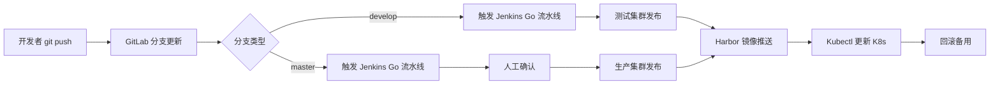
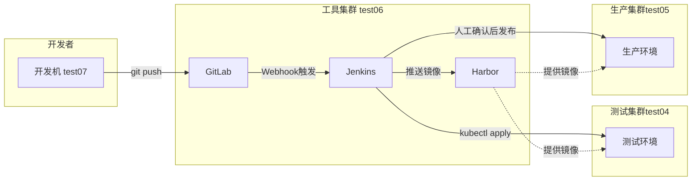
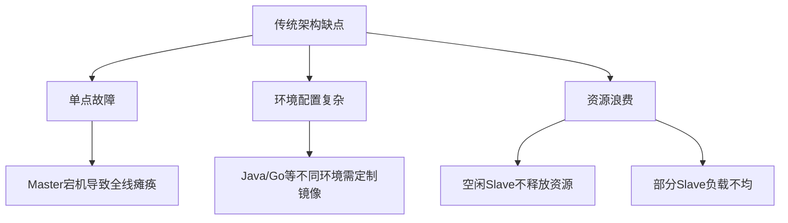
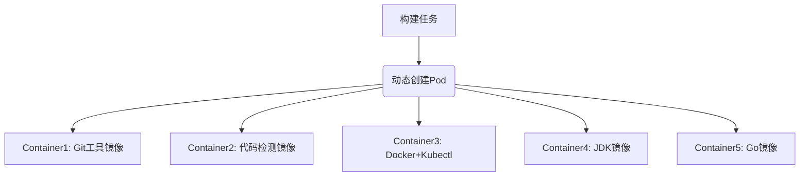
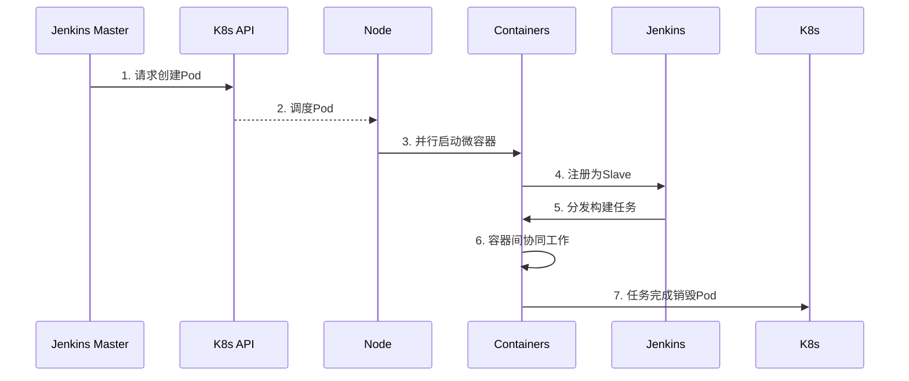

# 基于 k8s 的 CI/CD 项目

[构建K8s CICD全流程](https://egonlin.com/?p=7109)

---

## **一、项目目标**  
构建基于 Kubernetes 的 CI/CD 流水线，实现应用自动化发布，提升企业自动化水平。  

**核心组件**：  

- **GitLab**：管理代码版本（项目：`greenhat`）。  
- **Jenkins**：执行流水线任务。  
- **Harbor**：私有镜像仓库。  
- **Kubernetes**：运行应用程序的集群环境。  

---

## **二、流水线设计**  
### **1. 通用流程（Python/Go 共用）**  



1. **拉取代码**  
   - Jenkins 从 GitLab 的 `greenhat` 项目拉取新代码。  
2. **测试**  
   - 执行自动化测试。  
     - **Python 应用**：执行 pytest/unitest 等测试
     - **Go 应用**：执行 go test 等测试
3. **构建**  
   - **Python 应用**：
     - **安装依赖**：通过 `pip install -r requirements.txt` 安装 Python 依赖包
     - **无需编译**（解释型语言）
   - **Go 应用**：
     - **依赖处理**：Go 编译会自动解析依赖（需提前 `go mod download`）
     - **编译代码**：通过 `go build -o app` 生成二进制可执行文件
4. **构建与推送镜像**  
   - 创建 Docker 镜像（Go 应用需要多阶段构建） → 推送至 Harbor 镜像仓库（确保版本可追溯）。 
5. **K8s 集群更新**  
   - 向指定 Kubernetes 集群发送 `kubectl` 命令，完成应用更新。  
6. **回滚机制**  
   - 提供人工交互选项，支持回滚操作。  

---

### **2. 分支发布策略**  

#### **场景 1：推送至 `develop` 分支**  
1. **触发条件**  
   - `git push origin develop` → GitLab 接收更新。  
   - GitLab 通过 Webhook 通知 Jenkins 触发 **Go 应用流水线**。  
2. **流水线执行**  
   - 步骤 1-4：拉代码、测试、构建、推送镜像到 Harbor。  
   - **分支判断**：`分支 == develop`  
     - 使用 **测试集群** 的 Kubernetes 上下文执行 `kubectl`，完成发布。  
   - 提供回滚交互选项。  

#### **场景 2：推送至 `master` 分支**  
1. **触发条件**  
   - `git push origin master` → GitLab 接收更新。  
   - GitLab 通过 Webhook 通知 Jenkins 触发 **Go 应用流水线**。  
2. **流水线执行**  
   - 步骤 1-4：拉代码、测试、构建、推送镜像到 Harbor。  
   - **分支判断**：`分支 == master`  
     - **人工确认**：提供交互式确认（是否继续发布）。  
     - 使用 **生产集群** 的 Kubernetes 上下文执行 `kubectl`。  
   - 提供回滚交互选项。  

> **安全机制**  
>
> - 生产发布需人工确认，避免误操作。  
> - 支持快速回滚，保障业务连续性。 

------

## 三、整体规划



---

### **1. 核心架构原则**  
1. **集群隔离**  
   - 严格分离 **工具集群**（Jenkins/GitLab/Harbor）、**测试集群** 和 **生产集群**，避免资源争抢。  
   - *公司实践*：使用 3 套独立 K8s 集群（实验环境复现时因资源限制采用单节点部署）。  

2. **方案选择**  
   - **采用方案**：`GitLab → Jenkins → Kubernetes`（非 GitLab Auto DevOps）。  

---

### **2. 集群规划与资源配置**  
| **集群角色**     | **主机名** | **IP 地址**  | **资源配置**                     | **核心用途**                                                 |
| ---------------- | ---------- | ------------ | -------------------------------- | ------------------------------------------------------------ |
| **测试环境集群** | `test04`   | 172.16.10.14 | **2核2G**（内存不足可降为 1.5G） | RD 测试：<br>- 运行测试版应用<br>- 自动化测试验证            |
| **生产环境集群** | `test05`   | 172.16.10.15 | **2核2G**（内存不足可降为 1.5G） | 运行生产应用：<br>- `product` 命名空间：正式生产环境<br>- `staging` 命名空间：预发布环境 |
| **工具集群**     | `test06`   | 172.16.10.16 | **8核16G**（最低要求）           | 运行管理工具：<br>- Jenkins<br>- GitLab<br>- Harbor          |
| **开发机**       | `test07`   | 172.16.10.17 | **1核512M**                      | 开发者本地工作：<br>- 编写代码<br>- 执行 `git push` 到 GitLab |

---

#### **关键注意事项**  
1. **Kubernetes 最低配置**  
   - **所有 K8s 节点**：至少 2 核 CPU（实验环境可接受 1.5G 内存，但 2G 更稳定）。  
   - *资源不足影响*：内存低于 2G 可能导致 K8s 组件（如 kubelet、etcd）运行异常。  

2. **工具集群资源要求**  
   - **必须 8核16G**：  
     - GitLab 和 Jenkins 均为资源密集型应用（尤其是 GitLab 内存占用高）。  
     - Harbor 存储镜像需充足磁盘空间（建议附加 100GB 存储）。  

3. **生产集群命名空间设计**  
   - `product`：真实生产流量（严格访问控制）。  
   - `staging`：预生产环境（用于最终发布前验证）。  

4. **节点部署方案**  
   - **实验环境**：所有集群采用**单节点部署**（资源受限时选择，[参考文档](https://egonlin.com/?p=7181)）。  
   - **生产环境**：应使用**多节点部署**（高可用要求）。  

---

### **3. 部署与网络细节**  
| **组件** | **部署位置**        | **网络要求**                                      |
| -------- | ------------------- | ------------------------------------------------- |
| Jenkins  | 工具集群 (`test06`) | 需访问 GitLab Webhook 和 K8s API                  |
| GitLab   | 工具集群 (`test06`) | 开放 HTTP/HTTPS 供开发机推送代码                  |
| Harbor   | 工具集群 (`test06`) | 提供镜像存储，需被 Jenkins 和 K8s 集群访问        |
| K8s 集群 | 各自独立节点        | 集群间网络互通（用于 Jenkins 远程执行 `kubectl`） |

---

## 四、k8s 集群安装准备：CentOS 7.6 基础配置

> **建议**：一开始就选择 **CentOS 7.9** 可避免部分兼容性问题（无需做系统升级）

**适用节点**：`test04`, `test05`, `test06`  

### 1. 基础系统配置  

#### **1.1 配置静态 IP 地址**  
- **操作**：编辑 `/etc/sysconfig/network-scripts/ifcfg-ens*` 文件，设置静态 IP（需根据实际网卡名调整）  
- **关键参数**：  
  
  ```bash
  BOOTPROTO=static
  ONBOOT=yes
  IPADDR=172.16.10.XX  # 对应主机 IP
  NETMASK=255.255.255.0
  GATEWAY=172.16.10.2 
  DNS1=8.8.8.8
  ```

#### **1.2 关闭 NetworkManager**  
```bash
systemctl stop NetworkManager
systemctl disable NetworkManager
```

#### **1.3 关闭 SELinux 与防火墙**  
```bash
# 永久关闭 SELinux
sed -i "s/SELINUX=enforcing/SELINUX=disabled/" /etc/sysconfig/selinux
sed -i "s/SELINUX=enforcing/SELINUX=disabled/" /etc/selinux/config
setenforce 0  # 临时生效

# 关闭防火墙
systemctl stop firewalld.service
systemctl disable firewalld.service
```

#### **1.4 关闭 Swap 分区**  
**任选一种方案**：  
- **方案一（推荐）**：彻底关闭 Swap  
  ```bash
  swapoff -a  # 临时关闭
  sed -i '/ swap / s/^\(.*\)$/#\1/g' /etc/fstab  # 永久注释 Swap
  ```
- **方案二**：允许 kubelet 忽略 Swap  
  ```bash
  echo "KUBELET_EXTRA_ARGS=\"--fail-swap-on=false\"" > /etc/sysconfig/kubelet
  ```

#### **1.5 配置主机名**  
```bash
hostnamectl set-hostname test04  # test04 节点
hostnamectl set-hostname test05  # test05 节点
hostnamectl set-hostname test06  # test06 节点
```

#### **1.6 更新系统软件（排除内核）**  
```bash
yum install epel-release -y
yum update -y --exclude=kernel*
```

#### **1.7 安装基础软件包**  
```bash
yum install -y wget expect vim net-tools ntp bash-completion ipvsadm ipset jq iptables conntrack sysstat libseccomp
```

#### **1.8 可选：安装开发工具集**  
```bash
yum -y install python-setuptools python-pip gcc gcc-c++ autoconf libjpeg libjpeg-devel libpng libpng-devel freetype freetype-devel libxml2 libxml2-devel \
zlib zlib-devel glibc glibc-devel glib2 glib2-devel bzip2 bzip2-devel zip unzip ncurses ncurses-devel curl curl-devel e2fsprogs e2fsprogs-devel krb5-devel \
libidn libidn-devel openssl openssh openssl-devel nss_ldap openldap openldap-devel openldap-clients openldap-servers libxslt-devel libevent-devel ntp libtool \
bison libtool vim-enhanced python wget lsof iptraf strace lrzsz kernel-devel kernel-headers pam-devel tcl tk cmake ncurses-devel bison setuptool popt-devel \
net-snmp screen perl-devel pcre-devel net-snmp screen tcpdump rsync sysstat man iptables sudo libconfig git bind-utils tmux links numactl iftop bwm-ng net-tools expect
```

#### **1.9 系统版本验证**  
```bash
# 查看操作系统版本
cat /etc/redhat-release

# 查看内核版本
uname -r
```

---

### 2. 升级系统内核（推荐）  
> **原因**：Docker 和 Kubernetes 对内核要求较高（建议 4.4+），且不同内核版本的 IPVS 模块名称不同。  

一般来说，只有从 https://www.kernel.org/ 下载升编译安装的内核才是官方内核

不过，大多数Linux 发行版提供自行维护的内核，可以通过yum或rpm等包管理系统升级。

- ELRepo是一个为Linux提供驱动程序和内核映像的存储库，这里的升级方案就是采用ELRepo提供的内核通道

- ELRepo官网：http://elrepo.org/tiki/tiki-index.php

#### **升级步骤**  

1. **导入 ELRepo 仓库密钥**  
   
   ```bash
   rpm --import https://www.elrepo.org/RPM-GPG-KEY-elrepo.org
   ```
   
2. **安装 ELRepo 仓库**  
   ```bash
   yum -y install https://www.elrepo.org/elrepo-release-7.el7.elrepo.noarch.rpm
   ```

3. **查看可用内核版本**  
   ```bash
   yum --disablerepo="*" --enablerepo="elrepo-kernel" list available
   ```
   - `kernel-lt`：长期支持版（如 5.4）  
   - `kernel-ml`：主线最新版（如 5.17）  
   - 长期支持版（`kernel-lt`）比主线版（`kernel-ml`）更稳定  
   
4. **安装主线内核**  
   
   ```bash
   yum --enablerepo=elrepo-kernel install kernel-ml.x86_64 -y
   ```
   
5. **配置默认启动内核**  
   ```bash
   # 查看所有内核条目
   sudo awk -F\' '$1=="menuentry" {print i++ " : " $2}' /etc/grub2.cfg
   
   # 示例输出：
   # 0 : CentOS Linux (5.17.1-1.el7.elrepo.x86_64) 7 (Core)
   # 1 : CentOS Linux (3.10.0-1160.53.1.el7.x86_64) 7 (Core)
   
   # 设置默认启动项（选择新内核序号）
   grub2-set-default 0
   
   # 生成 GRUB 配置
   grub2-mkconfig -o /boot/grub2/grub.cfg
   ```

6. **验证默认内核**  
   ```bash
   grubby --default-kernel
   ```

7. **重启并检查**  
   ```bash
   reboot
   uname -r  # 应显示新内核版本（如 5.17.1）
   ```

---

#### 关键注意事项  
1. **内核版本差异**  
   - **3.x 内核**：IPVS 模块名为 `ip_vs`  
   - **5.x 内核**：IPVS 模块名为 `ipvs`（后续配置需注意）  
2. **资源节约方案**  
   - 若资源紧张，可跳过内核升级（需确保原生内核 ≥3.10）  

---

#### 📚 验证清单  
```bash
# 1. 确认 SELinux 已禁用
sestatus  # 应返回 "disabled"

# 2. 确认 Swap 已关闭
free -h  # Swap 行应全为 0

# 3. 验证防火墙状态
systemctl status firewalld  # 应显示 "inactive (dead)"

# 4. 检查主机名
hostnamectl  # 确认主机名正确

# 5. 内核版本验证（如升级）
uname -r  # 应 ≥4.4
```

------

### 3. 安装 docker

#### **3.1 卸载旧版 Docker（可选）**  
```bash
yum -y remove docker \
docker-client \
docker-client-latest \
docker-common \
docker-latest \
docker-latest-logrotate \
docker-logrotate \
docker-selinux \
docker-engine-selinux \
docker-engine
```

#### **3.2 安装 Docker 依赖及仓库**  
```bash
# 安装工具包
yum install -y yum-utils device-mapper-persistent-data lvm2

# 添加阿里云镜像源
yum-config-manager --add-repo http://mirrors.aliyun.com/docker-ce/linux/centos/docker-ce.repo

# 安装 Docker CE
yum install docker-ce -y
```

#### **3.3 启动并配置 Docker**  
```bash
# 启动服务并设置开机自启
systemctl start docker && systemctl enable docker

# 创建配置文件
cat > /etc/docker/daemon.json << EOF
{
  "exec-opts": ["native.cgroupdriver=systemd"], # 指定 Docker 使用 systemd 来管理容器的资源限制和隔离
  "registry-mirrors": ["https://reg-mirror.qiniu.com/"],
  "live-restore": true # 使得在 Docker 守护进程重启或崩溃时，正在运行的容器能够继续运行
}
EOF

# 重启生效
systemctl restart docker
docker info  # 验证配置
```

> Docker 与 kubelet 的 `cgroup driver` 必须保持一致
>
> - 确保K8s（Kubelet）能够准确、一致地对由Docker（或容器运行时）管理的容器进行资源计量和限制。这避免了由于使用不同Cgroup层次结构或管理方式而导致的资源管理混乱、限制失效和系统不稳定等问题。

---

### **4. 拉取 K8s 镜像到本地**  
> 因 `k8s.gcr.io` 访问受限，使用阿里云镜像源拉取后重命名  

#### **4.1 创建拉取脚本**  
```bash
cat > docker_pull_images_v1.18.1.sh << 'EOF'
#!/bin/bash
# 拉取镜像并重命名
images=(
  "registry.cn-hangzhou.aliyuncs.com/google_containers/kube-apiserver:v1.18.1"
  "registry.cn-hangzhou.aliyuncs.com/google_containers/kube-controller-manager:v1.18.1"
  "registry.cn-hangzhou.aliyuncs.com/google_containers/kube-scheduler:v1.18.1"
  "registry.cn-hangzhou.aliyuncs.com/google_containers/kube-proxy:v1.18.1"
  "registry.cn-hangzhou.aliyuncs.com/google_containers/pause:3.2"
  "registry.cn-hangzhou.aliyuncs.com/google_containers/etcd:3.4.3-0"
  "registry.cn-hangzhou.aliyuncs.com/google_containers/coredns:1.6.7"
)

for img in "${images[@]}"; do
  docker pull $img
done

# 重命名为 k8s.gcr.io 官方标签
docker tag registry.cn-hangzhou.aliyuncs.com/google_containers/kube-apiserver:v1.18.1 k8s.gcr.io/kube-apiserver:v1.18.1
docker tag registry.cn-hangzhou.aliyuncs.com/google_containers/kube-controller-manager:v1.18.1 k8s.gcr.io/kube-controller-manager:v1.18.1
docker tag registry.cn-hangzhou.aliyuncs.com/google_containers/kube-scheduler:v1.18.1 k8s.gcr.io/kube-scheduler:v1.18.1
docker tag registry.cn-hangzhou.aliyuncs.com/google_containers/kube-proxy:v1.18.1 k8s.gcr.io/kube-proxy:v1.18.1
docker tag registry.cn-hangzhou.aliyuncs.com/google_containers/pause:3.2 k8s.gcr.io/pause:3.2
docker tag registry.cn-hangzhou.aliyuncs.com/google_containers/etcd:3.4.3-0 k8s.gcr.io/etcd:3.4.3-0
docker tag registry.cn-hangzhou.aliyuncs.com/google_containers/coredns:1.6.7 k8s.gcr.io/coredns:1.6.7
EOF
```

#### **4.2 执行脚本并验证**  
```bash
# 添加执行权限并运行
chmod +x docker_pull_images_v1.18.1.sh
./docker_pull_images_v1.18.1.sh

# 检查镜像
docker images | grep 'k8s.gcr.io'
```

---

### **5. 安装 K8s 组件**  
**组件说明**：  
- `kubelet`：运行在所有节点，管理 Pod 生命周期  
- `kubeadm`：集群初始化工具  
- `kubectl`：Kubernetes 命令行客户端  

#### **5.1 配置 Kubernetes 仓库**  
```bash
cat <<EOF > /etc/yum.repos.d/kubernetes.repo
[kubernetes]
name=Kubernetes
baseurl=https://mirrors.aliyun.com/kubernetes/yum/repos/kubernetes-el7-x86_64
enabled=1
gpgcheck=0  # 关闭 GPG 检查
repo_gpgcheck=0
gpgkey=https://mirrors.aliyun.com/kubernetes/yum/doc/yum-key.gpg 
       https://mirrors.aliyun.com/kubernetes/yum/doc/rpm-package-key.gpg
EOF
```

#### **5.2 安装指定版本 (v1.18.1)**  
```bash
yum makecache fast
yum install -y kubelet-1.18.1-0.x86_64 kubeadm-1.18.1-0.x86_64 kubectl-1.18.1-0.x86_64 ipvsadm
```

---

### 6. 配置 IPVS 内核模块

> IPVS 提供高性能负载均衡，替代默认的 iptables  

#### **6.1 加载内核模块**  
```bash
# 通用模块
modprobe ip_vs
modprobe ip_vs_rr
modprobe ip_vs_wrr
modprobe ip_vs_sh

# 根据内核版本选择
KERNEL_VER=$(uname -r | cut -d. -f1)
if [ $KERNEL_VER -eq 3 ]; then
  modprobe nf_conntrack_ipv4  # 3.x 内核
else
  modprobe nf_conntrack       # 5.x 内核
fi

# 添加到开机自启
cat >> /etc/rc.local << EOF
modprobe ip_vs
modprobe ip_vs_rr
modprobe ip_vs_wrr
modprobe ip_vs_sh
if [ \$(uname -r | cut -d. -f1) -eq 3 ]; then
  modprobe nf_conntrack_ipv4
else
  modprobe nf_conntrack
fi
EOF

chmod +x /etc/rc.local
```

#### **6.2 配置网络参数**  
```bash
cat <<EOF > /etc/sysctl.d/k8s.conf
net.bridge.bridge-nf-call-ip6tables = 1
net.bridge.bridge-nf-call-iptables = 1
vm.swappiness = 0
EOF

# 加载 br_netfilter 模块并生效配置
modprobe br_netfilter
sysctl --system
```

#### **6.3 验证模块加载**  
```bash
lsmod | grep -e ip_vs -e nf_conntrack
# 应显示 ip_vs_* 和 nf_conntrack 模块
```

---

### **7. 配置并启动 Kubelet**  

#### **7.1 配置 cgroup 驱动**  
```bash
# 获取 Docker 使用的 cgroup 驱动
DOCKER_CGROUPS=$(docker info | grep 'Cgroup Driver' | awk '{print $3}')

# 配置 kubelet 使用相同驱动
cat > /etc/sysconfig/kubelet << EOF
KUBELET_EXTRA_ARGS="--cgroup-driver=$DOCKER_CGROUPS --pod-infra-container-image=k8s.gcr.io/pause:3.2"
EOF
```

#### **7.2 启动服务**  
```bash
systemctl daemon-reload
systemctl enable kubelet && systemctl restart kubelet

# 检查状态（预期会报错，待 kubeadm init 后解决）
systemctl status kubelet
```

---

### **8. 初始化 Master 节点**  
> **仅在集群的 Master 节点执行**（但在本项目中，test04~06都是各自的一套集群，所以每台主机都要初始化）

```bash
kubeadm init \
  --kubernetes-version=v1.18.1 \
  --service-cidr=10.96.0.0/12 \ # 指定 svc 的 ip 地址范围
  --pod-network-cidr=10.244.0.0/16 \ # 指定 pod 网络插件可以使用的 ip 地址范围
  --apiserver-advertise-address=172.16.10.14 \  # 指定 API Server 对外暴露服务时绑定的节点 IP 地址，注意替换为实际 Master IP
  --ignore-preflight-errors=Swap # 忽略预检查阶段关于交换分区 (Swap) 的错误
  
# 若初始化失败，可以使用如下代码清楚后重新初始化
kubeadm reset
```

##### **初始化成功标志**：  
1. 输出 `kubeadm join` 命令（用于 Node 加入集群）  
2. 生成管理员配置文件：  
   ```bash
   mkdir -p $HOME/.kube
   sudo cp -i /etc/kubernetes/admin.conf $HOME/.kube/config
   sudo chown $(id -u):$(id -g) $HOME/.kube/config
   ```

**去除污点**：

k8s 出于安全考虑默认情况下无法在 master 节点上部署 pod，于是用下面方法去掉 master 节点的污点：

```bash
kubectl taint nodes --all node-role.kubernetes.io/master-
```

------

### 9. Flannel 插件部署

#### 9.1 Pod 网络必要性
- **核心作用**：使集群内 Pod 能够相互通信（无网络插件则 Pod 无法通信）  
- **支持方案**：Flannel、Calico、Canal 等（本文使用 Flannel）  
- **兼容性**：需匹配初始化时的 `--pod-network-cidr`（本例为 `10.244.0.0/16`）  

---

#### **9.2 部署步骤**  

##### **（1） 下载 Flannel 配置文件**  
```bash
wget https://raw.githubusercontent.com/coreos/flannel/master/Documentation/kube-flannel.yml
```

##### **（2） 应用配置文件**  
```bash
kubectl apply -f kube-flannel.yml
```

##### **（3）关键配置说明（kube-flannel.yml）**  
```yaml
# 网络后端配置（默认 VXLAN）
net-conf.json: |
  {
    "Network": "10.244.0.0/16",  # 必须匹配 kubeadm init 的 --pod-network-cidr
    "Backend": {
      "Type": "vxlan"            # 可选 udp/host-gw，vxlan 性能更优
    }
  }
```

---

#### **9.3 验证安装结果**  

##### **（1）检查 Flannel Pod 状态**  
```bash
kubectl get pods -n kube-system -l app=flannel
```
**预期输出**（每个节点一个 Pod）：  
```
NAME                    READY   STATUS    RESTARTS   AGE
kube-flannel-ds-abc12   1/1     Running   0          2m
kube-flannel-ds-xyz34   1/1     Running   0          2m
```

##### **（2） 检查核心组件状态**  
```bash
kubectl get pods -n kube-system
```
**关键组件验证**：  
- `coredns` 应变为 **Running**（此前因网络未就绪为 Pending）  
- `kube-proxy` 全部运行正常  

##### **（3） 节点就绪状态检查**  
```bash
kubectl get nodes
```
**预期输出**：  
```
NAME      STATUS   ROLES    AGE   VERSION
test04    Ready    master   10m   v1.18.1
test05    Ready    <none>   8m    v1.18.1
```

---

#### 9.4 常见问题排查  

##### **问题 1：Flannel Pod 启动失败**  
- **现象**：`kube-flannel-ds-*` 处于 `CrashLoopBackOff`  
- **原因**：内核模块缺失  
- **解决**：  
  
  ```bash
  # 加载内核模块
  modprobe flannel  # 部分内核需显式加载
  
  # 查看日志定位问题
  kubectl logs -n kube-system <flannel-pod-name>
  ```

##### **问题 2：coredns 持续 Pending**  
- **原因**：网络插件未正确部署  
- **解决**：  
  ```bash
  # 重新应用 Flannel 配置
  kubectl delete -f kube-flannel.yml
  kubectl apply -f kube-flannel.yml
  ```

##### **问题 3：节点间网络不通**  
- **排查**：  
  
  ```bash
  # 检查 Flannel 接口
  ip addr show flannel.1
  
  # 验证路由
  ip route | grep flannel
  ```

------

## 五、安装 Jenkins 

**操作节点**：`test06`（工具集群）  

### 1. 创建jenkins.yaml文件
#### Jenkins定制化镜像说明

- **基础镜像**：`jenkins/jenkins:lts`（官方默认镜像）
- **镜像定制**：
  - 参考官方GitHub：https://github.com/jenkinsci/docker
  - 可预装插件到镜像中加速初始化
- **JDK版本建议**：
  - 视频中使用`jenkins/jenkins:lts-jdk11`
  - 遇到插件安装问题时尝试`jenkins/jenkins:lts-jdk21`
  - 最新版本查看官网：https://www.jenkins.io/download/

#### **版本一：基础安装**

```yaml
---
# 1. 持久化存储卷(PV)
apiVersion: v1
kind: PersistentVolume
metadata:
  name: jenkins-pv
  labels:
    type: local
spec:
  capacity:
    storage: 5Gi       # 存储容量5GB
  accessModes:
    - "ReadWriteOnce"  # 单节点读写模式
  hostPath: 
    path: /data/jenkins  # 宿主机挂载路径

---
# 2. 持久化存储声明(PVC)
apiVersion: v1
kind: PersistentVolumeClaim
metadata:
  name: jenkins-pvc
spec:
  accessModes:
  - "ReadWriteOnce"
  resources:
    requests:
      storage: 5Gi     # 请求5GB存储空间

---
# 3. 部署(Deployment)
apiVersion: apps/v1
kind: Deployment
metadata:
  name: jenkins
spec:
  replicas: 1          # 单副本部署
  selector:
    matchLabels:
      app: jenkins
  template:
    metadata:
      labels:
        app: jenkins   # 选择器标签
    spec:
      containers:
      - name: jenkins
        image: jenkins/jenkins:lts-jdk11  # JDK11版本镜像
        ports:
        - containerPort: 8080    # Web控制台端口
          name: web
          protocol: TCP
        - containerPort: 50000   # Agent连接端口
          name: agent
          protocol: TCP
        resources:
          limits:
            cpu: 1500m            # CPU限制1.5核
            memory: "6Gi"         # 内存限制6GB
          requests:
            cpu: 1500m            # CPU请求1.5核
            memory: "2048Mi"      # 内存请求2GB
        readinessProbe:           # 就绪探针
          httpGet:
            path: /login          # 检测登录页
            port: 8080
          initialDelaySeconds: 60 # 首次检测等待
          timeoutSeconds: 5       # 超时时间
          failureThreshold: 12     # 失败阈值
        volumeMounts:
        - name: jenkins-home      # 挂载数据卷
          mountPath: /var/jenkins_home  # Jenkins主目录
      volumes:
      - name: jenkins-home        # 数据卷声明
        persistentVolumeClaim:
          claimName: jenkins-pvc  # 关联PVC

---
# 4. 服务(Service)
apiVersion: v1
kind: Service
metadata:
  name: jenkins-init-service
spec:
  type: NodePort        # 节点端口类型
  ports:
  - port: 7096          # 服务端口
    name: web1
    nodePort: 7096      # 节点暴露端口(web访问)
    targetPort: 8080     # 容器目标端口
  - port: 50000         # Agent服务端口
    name: web2
    nodePort: 50000     # 节点暴露端口(Agent)
    targetPort: 50000    # 容器目标端口
  selector:
    app: jenkins        # 选择器标签
```

#### **版本二：加速插件安装（推荐）**

##### 核心优化原理

1. **域名劫持**：

   - 将`mirrors.jenkins-ci.org`解析到`127.0.0.1`

     - jenkins 就会给本地发送请求被 nginx 接收

   - 通过 `hostAliases` 实现：

     ```yaml
     hostAliases:
     - ip: "127.0.0.1"
       hostnames:
       - "mirrors.jenkins-ci.org"
     ```

2. **Sidecar代理**：

   - Nginx容器监听80端口（http默认端口）

   - 转发请求到清华源：

     ```yaml
     location / {
       proxy_pass https://mirrors.tuna.tsinghua.edu.cn/jenkins/;
     }
     ```

##### 完整配置文件

```yaml
---
# 1. 持久化存储卷(PV)
apiVersion: v1
kind: PersistentVolume
metadata:
  name: jenkins-pv
  labels:
    type: local
spec:
  capacity:
    storage: 5Gi
  accessModes:
    - "ReadWriteOnce"
  hostPath: 
    path: /data/jenkins

---
# 2. 持久化存储声明(PVC)
apiVersion: v1
kind: PersistentVolumeClaim
metadata:
  name: jenkins-pvc
spec:
  accessModes:
  - "ReadWriteOnce"
  resources:
    requests:
      storage: 5Gi

---
# 3. 代理配置(ConfigMap)
apiVersion: v1
kind: ConfigMap
metadata:
  name: jenkins-mirror-conf
data:
  nginx.conf: |  # Nginx配置文件
    user nginx;
    worker_processes  3;
    error_log  /dev/stderr;
    events {
      worker_connections  10240;
    }
    http {
      log_format main '$remote_addr - $remote_user [$time_local] "$request" '
                      '$status $body_bytes_sent "$http_referer" '
                      '"$http_user_agent" "$http_x_forwarded_for" $request_time';
      access_log    /dev/stdout main;
      server {
          listen 80;
          server_name mirrors.jenkins-ci.org;
          location / {
            proxy_redirect off;
            proxy_pass https://mirrors.tuna.tsinghua.edu.cn/jenkins/; # 清华源代理
            proxy_set_header X-Real-IP $remote_addr;
            proxy_set_header X-Forwarded-For $proxy_add_x_forwarded_for;
            proxy_set_header Accept-Encoding "";
            proxy_set_header Accept-Language "zh-CN";
          }
          # 禁止访问隐藏文件
          location ~ /\. {
            deny all;
          }
      }
    }

---
# 4. 部署(Deployment)
apiVersion: apps/v1
kind: Deployment
metadata:
  name: jenkins
spec:
  replicas: 1
  selector:
    matchLabels:
      app: jenkins
  template:
    metadata:
      labels:
        app: jenkins
    spec:
      # 域名劫持配置
      hostAliases:
      - ip: "127.0.0.1"
        hostnames:
        - "mirrors.jenkins-ci.org"  # 强制解析到本地
      
      # 双容器部署
      containers:
      # Sidecar容器: Nginx代理
      - name: mirror
        image: nginx:1.7.9
        ports:
        - containerPort: 80  # 监听80端口
        volumeMounts:
        - mountPath: /etc/nginx  # 挂载配置文件
          readOnly: true
          name: nginx-conf
      
      # 主容器: Jenkins
      - name: jenkins
        image: jenkins/jenkins:lts-jdk11
        ports:
        - containerPort: 8080
          name: web
          protocol: TCP
        - containerPort: 50000
          name: agent
          protocol: TCP
        resources:
          limits:
            cpu: 1500m
            memory: "6Gi"
          requests:
            cpu: 1500m
            memory: 2048Mi
        readinessProbe:
          httpGet:
            path: /login
            port: 8080
          initialDelaySeconds: 60
          timeoutSeconds: 5
          failureThreshold: 12
        volumeMounts:
        - name: jenkins-home
          mountPath: /var/jenkins_home
      
      # 卷声明
      volumes:
      - name: jenkins-home
        persistentVolumeClaim:
          claimName: jenkins-pvc
      - name: nginx-conf  # Nginx配置卷
        configMap:
          name: jenkins-mirror-conf
          items:
          - key: nginx.conf
            path: nginx.conf  # 配置文件路径

---
# 5. 服务(Service)
apiVersion: v1
kind: Service
metadata:
  name: jenkins-init-service
spec:
  type: NodePort
  ports:
  - port: 7096
    name: web1
    nodePort: 7096
    targetPort: 8080
  - port: 50000
    name: web2
    nodePort: 50000
    targetPort: 50000
  selector:
    app: jenkins
```

---

### **2. 部署 Jenkins Master**  
##### **1. 创建存储目录**  
```bash
mkdir -p /data/jenkins
chmod 777 /data/jenkins  # 确保 Jenkins 容器有写权限
```

##### **2. 解决 NodePort 范围限制**  

**原因**：k8s默认NodePort范围为30000-32767

```bash
# 修改 kube-apiserver 配置（在 Master 节点）
vim /etc/kubernetes/manifests/kube-apiserver.yaml
# 添加参数
spec:
  containers:
  - command:
    - kube-apiserver
    - --service-node-port-range=1024-65535  # 添加此行
```

##### **3. 应用部署文件**

需要等待一会儿，k8s会自动加载配置，加载完毕后执行：  

```bash
kubectl apply -f jenkins.yaml
```

##### **4. 获取管理员密码**  
```bash
# 获取 Pod 名称
POD_NAME=$(kubectl get pods -l app=jenkins -o jsonpath='{.items[0].metadata.name}')

# 查看初始密码
kubectl exec -it $POD_NAME -- cat /var/jenkins_home/secrets/initialAdminPassword
```

> **访问 Jenkins**
>
> - **访问地址**：`http://172.16.10.16:7096`（使用初始密码登录）  
>
> - **端口映射**：  
>
>   - `7096` → Jenkins Web 控制台（8080）  
>
>   - `50000` → Agent 通信端口  
>

---

### 3. 关于 jenkins-slave 的储备知识


#### 3.1 Jenkins 主从模式（Master-Slave）

##### **（1）分而治之 + 解耦架构**

- Master 节点：
  - 基础管理：流水线创建/修改
  - 提供操作入口（Web界面）
  - 任务调度中心
- Slave 节点：
  - 执行具体构建任务（流水线运行）

##### **（2）使用主从模式的必要性**

| 问题场景               | 后果            | 解决方案          |
| ---------------------- | --------------- | ----------------- |
| 自动化测试消耗大量资源 | 服务器卡顿/宕机 | 资源隔离到Slave   |
| 多任务并发抢占资源     | 构建效率低下    | 任务分发到多Slave |
| 高负载任务影响其他服务 | 服务不可用      | 计算资源分离      |

#### 3.2 传统主从架构痛点



#### 3.3 Kubernetes 动态 Pod Slave 解决方案

##### 架构升级

1. **Master 高可用**
   - 部署在 K8s 集群（自动故障恢复）
2. **Slave 动态化**
   - 按需创建/销毁 Pod（彻底解决资源浪费）

##### 传统静态 Slave 痛点

```
# Java Slave 镜像需求：
1. Git          4. Docker
2. 代码检测工具   5. Kubectl
3. JDK

# Go Slave 镜像需求：
1. Git          4. Docker
2. 代码检测工具   5. Kubectl
3. Go

# 问题：镜像冗余度>60%，单个镜像体积庞大
```

##### 动态 Pod Slave 核心思想



##### 微镜像分层设计

| 功能模块 | Java流水线       | Go流水线         | 复用性 |
| -------- | ---------------- | ---------------- | ------ |
| 代码拉取 | ✔️ (git镜像)      | ✔️ (git镜像)      | 100%   |
| 代码检测 | ✔️ (检测工具镜像) | ✔️ (检测工具镜像) | 100%   |
| 编译环境 | (JDK镜像)        | (Go镜像)         | 0%     |
| 镜像构建 | ✔️ (docker镜像)   | ✔️ (docker镜像)   | 100%   |
| K8s部署  | ✔️ (kubectl镜像)  | ✔️ (kubectl镜像)  | 100%   |

> **关键结论**：通过解耦构建工具链为微容器，实现环境标准化+资源动态分配，完美解决传统架构的镜像冗余和资源闲置问题。每次构建按需组合容器，任务完成立即释放资源。

##### 工作流程



------

### **4. 配置动态 Slave Pod**

> 利用 Jenkins 的 Kubernetes 插件，在 Jenkins 控制台配置 Pod 模板。当 Jenkins 任务（Job）需要执行时，会根据模板在指定的 Kubernetes 集群中动态创建一个 Pod 来运行该任务。任务完成后，Pod 会自动销毁。这种方式特别适合需要特定环境（如包含 Maven 等工具）的任务。

#### **4.1 安装 Kubernetes 插件**  
- **路径**：Manage Jenkins > Manage Plugins > Available  
- **插件名**：`Kubernetes`  
- **作用**：支持在 K8s 集群动态创建 Slave Pod  

#### **4.2 生成 K8s 连接凭据** 
```bash
# 获取 Jenkins 访问 K8s 集群的认证信息
# kubeconfig 文件路径：~/.kube/config
# 在 test06 节点操作
cd ~/.kube
awk '/certificate-authority-data/{print $2}' config | base64 -d > ca.crt
awk '/client-certificate-data/{print $2}' config | base64 -d > client.crt
awk '/client-key-data/{print $2}' config | base64 -d > client.key

# 生成 PKCS12 格式证书（设置密码如 egon123）
openssl pkcs12 -export -out cert.pfx -inkey client.key -in client.crt -certfile ca.crt
```

##### **上传凭据到 jenkins**

Manage Jenkins > Manage Credentials > 全局凭据 > 添加凭据


#### **4.3 配置 Jenkins 连接 K8s**  
**路径**：Manage Jenkins > 节点管理 > Configure Clouds > Add Kubernetes


**测试连接**：成功会显示 `Connected to Kubernetes v1.18.1`  

不要 `save`，继续操作：


Jenkins 地址和通道填的是 Jenkins 的 svc 地址，因为工具相关都是部署在同一个 k8s 集群内，工具之间都可以通过 svc 访问 Jenkins

---

### **5. 手动创建 Pod Template（演示用）**  
> **注意**：此模板仅用于演示，实际流水线中会通过 pipeline 脚本动态定义  

**路径**：`Manage Jenkins > 节点管理 > Configure Clouds > Pod Templates > Add Template > Pod Templates details`

#### **5.1 配置模板**


> **标签列表**：后面执行 job 会通过该值选中
>
> `cnych/jenkins:jnlp6` 镜像是在官方的 julp 镜像基础上定制的，加入了 docker/kubectl 等实用工具

#### 5.2 挂载目录

为了实现 “Docker in Docker” 以及在 Pod 中直接管理和操作 K8s 集群的功能，需要挂载两个主机目录到 Pod 中：

1. `/var/run/docker.sock`：这个文件允许 **Pod 中的容器共享宿主机的 Docker 引擎**。这种配置方式被称为“Docker in Docker”，意味着 Pod 内部的容器可以直接操作宿主机的 Docker 引擎。
2. `/root/.kube` 目录：将这个目录挂载到容器的 `/root/.kube` 目录下，目的是为了让 **Pod 中的容器可以使用 `kubectl` 工具来访问和管理 K8s 集群**。这样配置后，我们可以在 Slave Pod 中部署 K8s 应用。


> **了解 Docker in Docker（DinD）**
>
> **1. 什么是 Docker in Docker？**
>
> *   **定义：** 指在 Docker 容器内部运行 Docker 命令（如 `docker pull`, `docker build`, `docker run` 等）。
> *   **核心机制：** 容器内的 Docker 命令需要与宿主机上的 Docker 守护进程（daemon）通信。
> *   **通常不推荐：** 在容器内运行 Docker 本身并不是一个常见的最佳实践，因为容器通常应该专注于运行应用程序，而不是管理其他容器。
> *   **适用场景：** 主要用于需要容器化运行 Docker 操作的场景，例如：
>
> - **CI/CD (持续集成/持续部署)：** 当 Jenkins Agent 或其他 CI 工具本身运行在容器中时，需要在这个容器内执行 Docker 命令（拉取镜像、构建新镜像等）。
>
> **2. 如何实现 Docker in Docker？**
>
> *   **关键步骤：** 将宿主机上运行的 Docker 服务所使用的套接字文件 (`/var/run/docker.sock`) 挂载到目标容器（如 Jenkins Agent 容器）中。
> *   **原理：** 通过挂载 `docker.sock`，容器内部就相当于可以直接访问宿主机上的 Docker 守护进程。容器内的 `docker` 命令实际上是在与宿主机的 Docker Daemon 通信。
> *   **具体做法：**
>     *   使用 `docker run` 命令的 `-v` (volume) 参数。
>     *   将宿主机的 `/var/run/docker.sock` 挂载到容器的 `/var/run/docker.sock`（或其他路径，但通常保持一致）。
>     *   （可选但推荐）将宿主机的 `docker` 命令二进制文件也挂载到容器内，确保容器内有可执行的 `docker` 命令脚本。
>     *   （可选但推荐）设置环境变量 `DOCKER_HOST`，明确指定容器内 `docker` 命令应该连接到哪个 Docker 守护进程（通常就是挂载的 `unix:///var/run/docker.sock`）。
>
> **3. 示例**
> 以下是一个实现 Docker in Docker 的 `docker run` 命令示例：
>
> ```bash
> docker run -it --name docker-daemon --hostname daemon-test --network=host \
>   -v /var/run/docker.sock:/var/run/docker.sock \
>   -v /usr/bin/docker:/usr/bin/docker \
>   -e DOCKER_HOST="unix:///var/run/docker.sock" \
>   centos:7 /bin/bash
> ```

#### **5.3 权限配置（RBAC）**  
为了使 Jenkins 能够在 Kubernetes 集群中执行某些操作（如获取 Pod 信息），我们需要为其创建一个 ServiceAccount 并赋予相应的权限。

```yaml
# jenkins-rbac.yaml
apiVersion: v1
kind: ServiceAccount
metadata:
  name: jenkins
  namespace: default
---
kind: ClusterRole
apiVersion: rbac.authorization.k8s.io/v1beta1
metadata:
  name: jenkins
rules:
  - apiGroups: ["extensions", "apps"]
    resources: ["deployments", "ingresses"]
    verbs: ["create", "delete", "get", "list", "watch", "patch", "update"]
  - apiGroups: [""]
    resources: ["services"]
    verbs: ["create", "delete", "get", "list", "watch", "patch", "update"]
  - apiGroups: [""]
    resources: ["pods"]
    verbs: ["create","delete","get","list","patch","update","watch"]
  - apiGroups: [""]
    resources: ["pods/exec"]
    verbs: ["create","delete","get","list","patch","update","watch"]
  - apiGroups: [""]
    resources: ["pods/log", "events"]
    verbs: ["get","list","watch"]
  - apiGroups: [""]
    resources: ["secrets"]
    verbs: ["get"]
---
apiVersion: rbac.authorization.k8s.io/v1beta1
kind: ClusterRoleBinding
metadata:
  name: jenkins
  namespace: default
roleRef:
  apiGroup: rbac.authorization.k8s.io
  kind: ClusterRole
  name: jenkins
subjects:
  - kind: ServiceAccount
    name: jenkins
    namespace: default
```
**应用配置**：  
```bash
kubectl apply -f jenkins-rbac.yaml
```

然后在 Slave Pod 配置的地方点击下面的`高级`，添加上对应的 SA 即可：


---

### **6. 验证动态 Slave**

创建一个job任务，测试能否启动一个pod来运行slave，并观察job运行完毕后pod是否自动销毁

路径：`jenkins首页 -> 新建任务 -> 输入一个任务名称、选择 Freestyle project（自由风格） 类型的任务`


然后往下拉，在 Build 区域选择 `Execute shell`


填入测试命令，点击保存：

```bash
echo "===== Docker in Docker 测试 ====="
docker info

echo "===== K8s 集群访问测试 ====="
kubectl get pods

sleep 120  # 保留 Pod 便于观察
```

然后点击左侧 `立即构建`，构建结束后可点击构建历史查看控制台输出

------

## 六、部署 Gitlab

### 1. GitLab 架构概述
GitLab 部署包含三个核心组件：
1. **Redis**：缓存服务
2. **PostgreSQL**：数据库服务
3. **GitLab 核心应用**：主程序

> - 这里选择的镜像不是官方的，而是 Gitlab 容器化中使用得非常多的一个第三方镜像：`sameersbn/gitlab`，基本上与官方保持同步更新，地址：[Docker GitLab by sameersbn](https://www.damagehead.com/docker-gitlab/)
> - 如果已经有可使用的 Redis 或 Postgresql 服务的话，那么直接配置在 Gitlab 环境变量中即可，如果没有的话就单独部署

------

### 2. 部署 Redis

**配置文件：gitlab-redis.yaml**
```yaml
apiVersion: apps/v1
kind: Deployment
metadata:
  name: redis
  namespace: default
  labels:
    name: redis
spec:
  selector:
    matchLabels:
      name: redis
  template:
    metadata:
      name: redis
      labels:
        name: redis
    spec:
      containers:
      - name: redis
        resources:
          limits:
            cpu: 1
            memory: "2Gi"
          requests:
            cpu: 1
            memory: "2048Mi"
        image: sameersbn/redis:4.0.9-2
        imagePullPolicy: IfNotPresent
        ports:
        - name: redis
          containerPort: 6379
        volumeMounts:
        - mountPath: /var/lib/redis
          name: data
        livenessProbe:
          exec:
            command:
            - redis-cli
            - ping
          initialDelaySeconds: 30
          timeoutSeconds: 5
        readinessProbe:
          exec:
            command:
            - redis-cli
            - ping
          initialDelaySeconds: 30
          timeoutSeconds: 1
      volumes:
      - name: data
        emptyDir: {}
---
apiVersion: v1
kind: Service
metadata:
  name: redis
  namespace: default
  labels:
    name: redis
spec:
  ports:
    - name: redis
      port: 6379
      targetPort: redis
  selector:
    name: redis
```

------

### 3. 部署 PostgreSQL

**前置准备：**

```bash
mkdir -p /data/postgresql
```

**配置文件：gitlab-postgresql.yaml**

> 存储 pv、pvc 可以根据自己的需求设置

```yaml
apiVersion: v1
kind: PersistentVolume
metadata:
  name: postgresql-pv
  namespace: default
  labels:
    type: local
spec:
  capacity:
    storage: 10Gi
  accessModes:
    - "ReadWriteOnce"
  hostPath: 
    path: /data/postgresql
---
apiVersion: v1
kind: PersistentVolumeClaim
metadata:
  name: postgresql-pvc
  namespace: default
spec:
  accessModes:
  - "ReadWriteOnce"
  resources:
    requests:
      storage: 10Gi # for 测试
---
apiVersion: apps/v1
kind: Deployment
metadata:
  name: postgresql
  namespace: default
  labels:
    name: postgresql
spec:
  selector:
    matchLabels:
      name: postgresql
  template:
    metadata:
      name: postgresql
      labels:
        name: postgresql
    spec:
      containers:
      - name: postgresql
        resources:
          limits:
            cpu: 4
            memory: "4Gi"
          requests:
            cpu: 2
            memory: "2048Mi"
        image: sameersbn/postgresql:10-2
        imagePullPolicy: IfNotPresent
        env:
        - name: DB_USER
          value: gitlab
        - name: DB_PASS
          value: passw0rd
        - name: DB_NAME
          value: gitlab_production
        - name: DB_EXTENSION
          value: pg_trgm
        - name: USERMAP_UID
          value: "999"
        - name: USERMAP_GID
          value: "999"
        ports:
        - name: postgres
          containerPort: 5432
        volumeMounts:
        - mountPath: /var/lib/postgresql
          name: data
        readinessProbe:
          exec:
            command:
            - pg_isready
            - -h
            - localhost
            - -U
            - postgres
          initialDelaySeconds: 30
          timeoutSeconds: 1
      volumes:
      - name: data
        persistentVolumeClaim:
          claimName: postgresql-pvc
---
apiVersion: v1
kind: Service
metadata:
  name: postgresql
  namespace: default
  labels:
    name: postgresql
spec:
  ports:
    - name: postgres
      port: 5432
      targetPort: postgres
  selector:
    name: postgresql
```

------

### 4. 部署 GitLab 核心应用

**前置准备：**
```bash
mkdir -p /data/gitlab
```

**配置文件：gitlab.yaml**
```yaml
apiVersion: v1
kind: PersistentVolume
metadata:
  name: gitlab-pv
  namespace: default
  labels:
    type: local
spec:
  capacity:
    storage: 10Gi
  accessModes:
    - "ReadWriteOnce"
  hostPath: 
    path: /data/gitlab
---
apiVersion: v1
kind: PersistentVolumeClaim
metadata:
  name: gitlab-pvc
  namespace: default
spec:
  accessModes:
  - "ReadWriteOnce"
  resources:
    requests:
      storage: 10Gi
---
apiVersion: apps/v1
kind: Deployment
metadata:
  name: gitlab
  namespace: default
  labels:
    name: gitlab
spec:
  selector:
    matchLabels:
      name: gitlab
  template:
    metadata:
      name: gitlab
      labels:
        name: gitlab
    spec:
      initContainers:
      - name: fix-permissions
        image: busybox
        command: ["sh", "-c", "chown -R 1000:1000 /home/git/data"]
        securityContext:
          privileged: true
        volumeMounts:
        - name: data
          mountPath: /home/git/data
      containers:
      - name: gitlab
        resources:
          requests:
            cpu: 2
            memory: "2Gi"
          limits:
            cpu: 4
            memory: "4Gi"
        image: sameersbn/gitlab:12.9.5
        imagePullPolicy: IfNotPresent
        env:
        - name: TZ
          value: Asia/Shanghai
        - name: GITLAB_TIMEZONE
          value: Beijing
        - name: GITLAB_SECRETS_DB_KEY_BASE
          value: long-and-random-alpha-numeric-string
        - name: GITLAB_SECRETS_SECRET_KEY_BASE
          value: long-and-random-alpha-numeric-string
        - name: GITLAB_SECRETS_OTP_KEY_BASE
          value: long-and-random-alpha-numeric-string
        - name: GITLAB_ROOT_PASSWORD
          value: 'egon@666'
        - name: GITLAB_ROOT_EMAIL
          value: 18611453110@163.com
        - name: GITLAB_HOST
          value: git.k8s.local            # 该域名会是你后面从gitlab里拉取项目的地址，需要添加解析才行
        - name: GITLAB_PORT               # 这个端口很重要，与svc对应好
          value: "1180"
        - name: GITLAB_SSH_PORT           # 这个端口很重要，与svc对应好
          value: "30022"
        - name: GITLAB_NOTIFY_ON_BROKEN_BUILDS
          value: "true"
        - name: GITLAB_NOTIFY_PUSHER
          value: "false"
        - name: GITLAB_BACKUP_SCHEDULE
          value: daily
        - name: GITLAB_BACKUP_TIME
          value: 01:00
        - name: DB_TYPE
          value: postgres
        - name: DB_HOST
          value: postgresql
        - name: DB_PORT
          value: "5432"
        - name: DB_USER
          value: gitlab
        - name: DB_PASS
          value: passw0rd
        - name: DB_NAME
          value: gitlab_production
        - name: REDIS_HOST
          value: redis
        - name: REDIS_PORT
          value: "6379"
        ports:
        - name: http
          containerPort: 80
        - name: ssh
          containerPort: 22
        volumeMounts:
        - mountPath: /home/git/data
          name: data
        readinessProbe:
          httpGet:
            path: /
            port: 80
          initialDelaySeconds: 60
          timeoutSeconds: 1
      volumes:
      - name: data
        persistentVolumeClaim:
          claimName: gitlab-pvc
---
apiVersion: v1
kind: Service
metadata:
  name: gitlab
  namespace: default
  labels:
    name: gitlab
spec:
  type: NodePort
  ports:
    - name: http
      port: 80
      targetPort: http
      nodePort: 1180
    - name: ssh
      port: 22
      targetPort: ssh
      nodePort: 30022
  selector:
    name: gitlab
```

**验证**：

```bash
kubectl  get pods |grep -v jenkins
# 输出：
NAME                         READY   STATUS    RESTARTS   AGE
gitlab-5954f566bf-lcl7j      1/1     Running   0          99s
postgresql-8b5cfff54-5qfdl   1/1     Running   0          108s
redis-bb67747bf-bnkzd        1/1     Running   0          103s
 
kubectl  get svc |grep gitlab
# 输出：
gitlab                 NodePort    10.97.217.189    <none>        80:1180/TCP,22:30022/TCP        110s
```

------

### 5. 关键配置说明
1. **管理员账户**：
   - 用户名：`root`
   - 密码：`egon@666`
   - 邮箱：`18611453110@163.com`

2. **访问端点**：
   - Web 地址：`http://git.k8s.local:1180`
   - SSH 地址：`ssh://git@git.k8s.local:30022`

3. **端口映射**：
   
   | 服务类型 | 容器端口 | NodePort | 访问方式 |
   | -------- | -------- | -------- | -------- |
   | HTTP     | 80       | 1180     | Web 访问 |
   | SSH      | 22       | 30022    | Git 操作 |

------

### 6. 域名解析配置

> 需要访问gitlab的有哪些，就在哪里添加解析
>     1、k8s的工具集群，里面安装有jenkins需要访问gitlab
>     2、开发机
>     3、需要访问gitlab的web界面的用户

- **工具集群内部解析**：

   ```bash
   kubectl -n kube-system edit cm coredns
   ```
   在 `Corefile` 的 `hosts` 部分添加：
   ```text
   hosts {
     172.16.10.16 git.k8s.local
     fallthrough
   }
   ```
   重启 CoreDNS：
   ```bash
   kubectl -n kube-system scale deployment coredns --replicas=0
   kubectl -n kube-system scale deployment coredns --replicas=2
   ```

- **开发机解析**：
   ```bash
   echo "172.16.10.16 git.k8s.local" >> /etc/hosts
   ```

- **Windows 主机解析**：
   编辑 `C:\Windows\System32\drivers\etc\hosts` 添加：
   ```text
   172.16.10.16 git.k8s.local
   ```

------

## 七、开发机配置登录 GitLab

> 开发机：172.16.10.17

### 1. 配置步骤

#### 1.1 添加 GitLab 域名解析
```bash
# 将 GitLab 域名指向工具集群节点 IP
echo "172.16.10.16 git.k8s.local" >> /etc/hosts
```

#### 1.2 生成 SSH 密钥对
```bash
# 生成 RSA 密钥对（默认路径 /root/.ssh/）
ssh-keygen -t rsa -b 4096  # 连续回车使用默认设置

# 查看生成的公钥
cat /root/.ssh/id_rsa.pub
```
#### 1.3 添加公钥到 GitLab
1. 浏览器访问 `http://git.k8s.local:1180`
2. 使用 root/`egon@666` 登录
3. 右上角用户头像 → **Settings** → **SSH Keys**
4. 粘贴 `id_rsa.pub` 内容
5. 点击 **Add key**

#### 1.4 配置 Git 并提交代码
```bash
# 安装 Git
yum install git -y

# 克隆项目（使用 SSH 地址）
git clone ssh://git@git.k8s.local:30022/root/greenhat.git
# git clone 命令在克隆仓库时，会自动将远程仓库的默认名称设置为 origin
# 故此处无需再 git remote add origin ssh://...

# 进入项目目录
cd greenhat

# 配置用户信息
git config --global user.name "root"
git config --global user.email "email@example.com"

# 创建测试文件
cat > test.sh <<EOF
echo ok>/tmp/a.log
sleep 100000
EOF

# 提交代码
git add .
git commit -m "第一次提交"
git push origin master
```

------

### 2. 验证操作

1. **GitLab 检查**：
   - 登录 GitLab Web 界面
   - 进入 `root/greenhat` 项目
   - 确认存在 `test.sh` 文件
   - 查看提交记录显示"第一次提交"

2. **开发机验证**：
   ```bash
   # 查看远程仓库配置
   git remote -v
   # 应显示：
   # origin  ssh://git@git.k8s.local:30022/root/greenhat.git (fetch)
   # origin  ssh://git@git.k8s.local:30022/root/greenhat.git (push)
   ```

------

### 3. 关键配置说明

1. **SSH 地址格式**：
   ```
   ssh://git@git.k8s.local:30022/root/greenhat.git
   ```
   - `git`：固定用户名
   - `git.k8s.local`：GitLab 域名
   - `30022`：SSH 服务的 NodePort
   - `/root/greenhat.git`：项目路径

2. **端口要求**：
   - 确保开发机的防火墙开放对 172.16.10.16:30022 的访问

> 完成配置后，开发者可在 172.16.10.17 上通过 SSH 协议与 GitLab 交互，实现代码推送和拉取操作。

------

## 八、部署 Harbor 私有镜像仓库

### 1. 创建 Harbor 命名空间
```bash
# 后续将所有与 harbor 相关的服务都部署到该命名空间
kubectl create namespace harbor
```

------

### 2. 配置 NFS 存储

#### 2.1 在工具集群节点（172.16.10.16）部署 NFS 服务端
```bash
# 安装 NFS 工具包
yum install -y nfs-utils

# 启动并启用 NFS 服务
systemctl start nfs && systemctl enable nfs
systemctl status nfs
chkconfig nfs on

# 创建共享目录
mkdir -p /data/nfs/harbor

# 配置共享目录权限
cat > /etc/exports <<EOF
/data/nfs/harbor 172.16.10.0/24(rw,no_root_squash)
EOF

# 重启服务并验证
systemctl restart nfs
showmount -e localhost # 检查共享目录信息
```

#### 2.2 在工具集群所有 K8s 节点安装 NFS 客户端
```bash
yum -y install nfs-utils
systemctl start nfs-utils && systemctl enable nfs-utils
systemctl status nfs-utils
```

------

### 3. 部署 NFS Provisioner

```bash
cat > nfs-provisioner.yaml << EOF
apiVersion: v1
kind: ServiceAccount
metadata:
  name: nfs-provisioner
  namespace: harbor
  
---
# NFS provisioner 被授予了管理 PV、PVC、StorageClass 等资源的权限
apiVersion: rbac.authorization.k8s.io/v1
kind: ClusterRole
metadata:
  name: nfs-provisioner-cr
rules:
 - apiGroups: [""]
   resources: ["persistentvolumes"]
   verbs: ["get", "list", "watch", "create", "delete"]
 - apiGroups: [""]
   resources: ["persistentvolumeclaims"]
   verbs: ["get", "list", "watch", "update"]
 - apiGroups: ["storage.k8s.io"]
   resources: ["storageclasses"]
   verbs: ["get", "list", "watch"]
 - apiGroups: [""]
   resources: ["events"]
   verbs: ["create", "update", "patch"]
 - apiGroups: [""]
   resources: ["services", "endpoints"]
   verbs: ["get"]
 - apiGroups: ["extensions"]
   resources: ["podsecuritypolicies"]
   resourceNames: ["nfs-provisioner"]
   verbs: ["use"]
---
apiVersion: rbac.authorization.k8s.io/v1
kind: ClusterRoleBinding
metadata:
  name: run-nfs-provisioner
subjects:
  - kind: ServiceAccount
    name: nfs-provisioner
    namespace: harbor
roleRef:
  kind: ClusterRole
  name: nfs-provisioner-cr
  apiGroup: rbac.authorization.k8s.io
  
---
# 在 harbor 命名空间内，provisioner 可以操作 endpoints 资源
apiVersion: rbac.authorization.k8s.io/v1
kind: Role
metadata:
  name: nfs-role
  namespace: harbor
rules:
  - apiGroups: [""]
    resources: ["endpoints"]
    verbs: ["get","list","watch","create","update","patch"]
---
kind: RoleBinding
apiVersion: rbac.authorization.k8s.io/v1
metadata:
  name: leader-locking-nfs-provisioner
  namespace: harbor
subjects:
 - kind: ServiceAccount
   name: nfs-provisioner
   namespace: harbor
roleRef:
 kind: Role
 name: nfs-role
 apiGroup: rbac.authorization.k8s.io
 
---
# Provisioner 会监听 harbor 命名空间内的 PVC 请求，并为它们自动创建 NFS 类型的 PV
apiVersion: apps/v1
kind: Deployment
metadata:
  name: nfs-provisioner
  namespace: harbor
spec:
  selector:
    matchLabels:
      app: nfs-provisioner
  replicas: 1
  strategy:
    type: Recreate
  template:
    metadata:
      labels:
        app: nfs-provisioner
    spec:
      serviceAccount: nfs-provisioner
      containers:
      - name: nfs-provisioner
        image: registry.cn-beijing.aliyuncs.com/mydlq/nfs-subdir-external-provisioner:v4.0.0
        imagePullPolicy: IfNotPresent
        volumeMounts:
        - name: nfs-client-root
          mountPath: /persistentvolumes
        env:
          - name: PROVISIONER_NAME
            value: example.com/nfs
          - name: NFS_SERVER
            value: 172.16.10.16   # NFS服务端地址
          - name: NFS_PATH
            value: /data/nfs/harbor
      volumes:
      - name: nfs-client-root
        nfs:
          server: 172.16.10.16   #  NFS服务端地址
          path: /data/nfs/harbor  # NFS共享目录
EOF

# 部署 Provisioner
kubectl apply -f nfs-provisioner.yaml
kubectl -n harbor get pod
```

------

### 4. 创建 Harbor 存储类

Harbor 的 database 和 redis 组件为有状态服务，需要对 Harbor 数据做持久化存储。

本处基于 NFS 创建 StorageClass 存储类，NFS 服务器和共享目录为：

- NFS服务器地址：172.16.10.16

- NFS共享目录：/data/nfs/harbor

```bash
cat > harbor-storageclass.yaml <<EOF
apiVersion: storage.k8s.io/v1
kind: StorageClass
metadata:
  name: harbor-storageclass
provisioner: example.com/nfs #指定外部存储供应商，这里的名称要和 provisioner 配置文件中的环境变量 PROVISIONER_NAME 保持一致
parameters:
  archiveOnDelete: "false"
EOF

# 部署存储类
kubectl apply -f harbor-storageclass.yaml
kubectl -n harbor get storageclass
```

------

### 5. 安装 Helm

```bash
# 官网：https://github.com/helm/helm/releases
wget https://get.helm.sh/helm-v3.9.0-linux-amd64.tar.gz
tar xf helm-v3.9.0-linux-amd64.tar.gz -C /data/
echo 'export PATH=/data/linux-amd64:$PATH' >> /etc/profile
source /etc/profile
```

------

### 6. 添加 Harbor Helm 仓库

```bash
helm repo add harbor https://helm.goharbor.io
helm repo list
```

------

#### 7. 下载并配置 Harbor Chart

```bash
helm pull harbor/harbor
tar zxvf harbor-1.8.2.tgz
cd harbor
```

修改 `values.yaml` 文件：
```yaml
expose:
  type: nodePort      # 这没有Ingress环境，使用NodePort的服务访问方式。   
  tls:
    enabled: false    # 关闭tls安全加密认证（如果开启需要配置证书）
...
externalURL: http://172.16.10.16:30002   # 使用nodePort且关闭tls认证，则此处需要修改为http协议和expose.nodePort.ports.http.nodePort指定的端口号，IP即为kubernetes的节点IP地址
 
# 持久化存储配置部分
persistence:
  enabled: true   # 开启持久化存储
  resourcePolicy: "keep" # 确保 Pod 使用的数据卷及其数据在 Pod 被删除后仍然存活和可重用
  persistentVolumeClaim: # 定义Harbor各个组件的PVC持久卷部分
    registry:            # registry组件（持久卷）配置部分
      existingClaim: ""
    storageClass: "harbor-storageclass"           # 前面创建的StorageClass，其它组件同样配置
      subPath: ""
      accessMode: ReadWriteMany          # 卷的访问模式，需要修改为ReadWriteMany，允许多个组件读写，否则有的组件无法读取其它组件的数据
      size: 5Gi
    chartmuseum:   # chartmuseum组件（持久卷）配置部分
      existingClaim: ""
      storageClass: "harbor-storageclass"
      subPath: ""
      accessMode: ReadWriteMany
      size: 5Gi
    jobservice:    # 异步任务组件（持久卷）配置部分
      existingClaim: ""
      storageClass: "harbor-storageclass"    #修改，同上
      subPath: ""
      accessMode: ReadWriteMany
      size: 1Gi
    database:     # PostgreSQl数据库组件（持久卷）配置部分
      existingClaim: ""
      storageClass: "harbor-storageclass"
      subPath: ""
      accessMode: ReadWriteMany
      size: 1Gi
    redis:        # Redis缓存组件（持久卷）配置部分
      existingClaim: ""
      storageClass: "harbor-storageclass"
      subPath: ""
      accessMode: ReadWriteMany
      size: 1Gi
    trivy:        # Trity漏洞扫描插件（持久卷）配置部分
      existingClaim: ""
      storageClass: "harbor-storageclass"
      subPath: ""
      accessMode: ReadWriteMany
      size: 5Gi
...
harborAdminPassword: "Harbor12345"   # admin初始密码，不需要修改
...
metrics:
  enabled: true  # 是否启用监控组件（可以使用Prometheus监控Harbor指标），如果设置为 true，Harbor 将会暴露一些端点，非必须操作
  core: # Harbor 的核心组件，负责管理镜像仓库的主要功能
    path: /metrics # 核心组件暴露监控指标的路径
    port: 8001
  registry: # Harbor 的注册表组件，负责存储和提供容器镜像
    path: /metrics
    port: 8001
  jobservice: # Harbor 的工作服务组件，负责处理后台任务，如镜像同步、删除等
    path: /metrics
    port: 8001
  exporter: # Harbor 的指标导出器组件，负责收集和暴露其他组件的指标数据
    path: /metrics
    port: 8001
## 以下部分的功能是 Harbor 2.4 版本引入的，不需要对其进行修改
```

**扩展**：

如果不希望安装最新的版本，可以通过以下命令修改镜像版本号来安装指定的版本：

```bash
sed  -i   /tag/s/v2.4.2/v2.3.5/g  values.yaml
```

------

### 8. 安装 Harbor

```bash
helm install harbor . -n harbor
```

------

### 9. 验证部署

```bash
kubectl -n harbor get pods
kubectl -n harbor get svc
```

输出示例：
```
NAME                                    READY   STATUS    RESTARTS   AGE
harbor-chartmuseum-7fd694bb8-pmllp      1/1     Running   0          55s
harbor-core-7c6944f9cf-shclb            1/1     Running   0          55s
harbor-database-0                       1/1     Running   0          55s
harbor-jobservice-bc848f555-qbd5s       1/1     Running   0          55s
harbor-nginx-f546d84f5-lslcj            1/1     Running   0          55s
harbor-notary-server-788754ccf4-xzslr   1/1     Running   0          55s
harbor-notary-signer-88496c75b-5ctj6    1/1     Running   0          55s
harbor-portal-bdc75c86b-fgn2t           1/1     Running   0          55s
harbor-redis-0                          1/1     Running   0          55s
harbor-registry-7b745f4f85-zs7lj        2/2     Running   0          55s
harbor-trivy-0                          1/1     Running   0          55s

NAME                   TYPE        CLUSTER-IP      EXTERNAL-IP   PORT(S)                       AGE
harbor                 NodePort    10.104.8.173    <none>        80:30002/TCP,4443:30004/TCP   68s
# 集群中的每个节点都会在端口 30002 上监听外部流量，并将流量转发到 Service 的内部端口 80（内部端口用于集群内部通信。只有集群内的组件（Pod、Service）能够直接通过 ClusterIP + 内部端口来访问服务。）
```

------

### 10. 访问 Harbor UI

- 访问地址：`http://172.16.10.16:30002`
- 用户名：`admin`
- 密码：`Harbor12345`
- 新建项目：
  - 项目名称：`online`
  - 存储容量：`10 GiB`


------

### 11. 配置 Docker 客户端

在所有 K8s 节点（包括测试、生产、工具集群）执行：

1. 修改 Docker 配置：

   ```bash
   # 如果直接登录harbor仓库会报错http: server gave HTTP response to HTTPS client，需要配置insecure-registries
   cat > /etc/docker/daemon.json <<EOF
   {
     "exec-opts": ["native.cgroupdriver=systemd"],
     "insecure-registries": ["172.16.10.16:30002"],
     "registry-mirrors": ["https://reg-mirror.qiniu.com/"],
     "live-restore": true
   }
   EOF
   
   systemctl restart docker
   ```
2. 登录 Harbor：

   push 或者 pull 操作都需要登录 Harbor，后面我们需要在测试、生产集群 pull，在工具集群 push，所以三套集群都需要执行登录操作。

   ```bash
   docker login -u admin -p Harbor12345 http://172.16.10.16:30002
   ```

------

### 12. 推送和拉取镜像

```bash
# 拉取公共镜像
docker pull centos:8

# 标记镜像
docker tag centos:8 172.16.10.16:30002/online/centos:8

# 推送镜像到 Harbor
docker push 172.16.10.16:30002/online/centos:8

# 从 Harbor 拉取镜像
docker pull 172.16.10.16:30002/online/centos:8
```

> 完成部署后，Harbor 可作为私有镜像仓库用于存储和管理 Docker 镜像，支持 CI/CD 流程中的镜像推送和拉取操作。

------

## 九、打通 Jenkins 与 GitLab 

### 1. Pipeline in Jenkins

#### 1.1 核心概念

- **Pipeline 作用**：

   - **传统上线流程及痛点**
     - **手动执行步骤**：
       - 1️⃣ 拉取代码
       - 2️⃣ 运行单元测试
       - 3️⃣ 构建（配置环境/下载依赖/编译生成**可执行程序**）
       - 4️⃣ 制作容器镜像
       - 5️⃣ 编写或更新 Kubernetes YAML 配置，部署新版镜像上线
     - **核心问题**：
       - ❌ **流程繁琐**：需人工在多台主机依次操作，步骤割裂。
       - ❌ **缺乏可视化**：无法直观跟踪进度和状态。
       - ❌ **易出错**：人工操作易遗漏或误配。
       - ❌ **回滚困难**：版本回溯复杂耗时。
   - **Pipeline 解决方案**
     - **核心机制**：
       将代码拉取 → 测试 → 构建 → 镜像打包 → 部署的 ​**​多节点任务串联成自动化流水线​**​，实现端到端流程编排。
     - **关键优势**：
       - ✅ **一键触发**：点击构建即自动执行全流程。
       - ✅ **可视化监控**：Jenkins 界面实时展示各阶段状态（成功/失败/日志）。
       - ✅ **错误可控**：自动化减少人工干预，降低出错概率。
       - ✅ **快速回滚**：结合版本管理工具（如 Git）可快速回溯至稳定版本。
       - ✅ **多节点协同**：支持跨主机分发任务（如测试、构建、部署分离执行）。

- **核心组件**：

   | **核心概念** | **定义**                            | **特点/作用**                                                | **示例**                                                     |
   | ------------ | ----------------------------------- | ------------------------------------------------------------ | ------------------------------------------------------------ |
   | **Node**     | 任务的执行环境                      | - 代表 Jenkins **Master 或 Agent**（如动态创建的 `JenkinsSlave`） <br /> - 提供 Step 运行的**物理/虚拟环境**（操作系统、工具链等） | `node('linux-agent') { ... }`                                |
   | **Stage**    | 逻辑分组的工作阶段                  | - **顺序执行**：前一 Stage 成功后才启动下一 Stage  <br />- **全成功判定**：所有 Stage 成功 → Pipeline 成功  <br />- **失败阻断**：任一 Stage 失败 → 后续 Stage 跳过 → Pipeline 失败  <br />- **跨节点能力**：单 Stage 可分布式跨多个 Node 运行 | `stage('Build') { ... }`  `stage('Deploy') { ... }`          |
   | **Step**     | 最小操作单元（由 Jenkins 插件提供） | - **原子化操作**：最基础的任务单元  <br />- **插件扩展**：通过插件支持多样操作（命令执行、文件读写、工具调用等）  <br />- **组合实现功能**：多个 Step 组合完成一个 Stage 的任务 | `sh 'make'`  `docker.build('app-image')`  `git 'https://repo.git'` |

   

   ```mermaid
   flowchart LR
     Pipeline --> Stage1 --> Step1_1 & Step1_2
     Pipeline --> Stage2 --> Step2_1
     Step1_1 -.运行于.-> Node1
     Step1_2 -.运行于.-> Node2
     Step2_1 -.运行于.-> Node3
   ```

   - **层级关系**：
      `Pipeline` → 包含多个 `Stage` → 每个 `Stage` 包含多个 `Step`
   - **执行逻辑**：
      `Step` 在 `Node` 上执行 → 组合完成 `Stage` → 串联 `Stage` 形成完整流水线

   > 📌 **关键记忆点**：
   >
   > - **Node = 在哪里跑**（执行环境）
   > - **Stage = 跑什么大任务**（逻辑分组）
   > - **Step = 具体怎么跑**（原子操作）

#### 1.2 创建方式

> Pipeline 脚本是由 Groovy 语言实现的，但是没必要专门去学，用到什么查什么就行

- **两种语法**：

   - Declarative（声明式）
   - Scripted Pipeline（脚本式）

- **两种实现方法**：

   - 在 Jenkins 的 Web UI 直接输入脚本

      - **适用场景**：快速测试简单流程
      - **特点**：无需代码仓库

      

   - 创建 Jenkinsfile 放入项目源码库，然后在 jenkins 配置 SCM，点击构建后拉取源代码，jenkins会从源代码/项目根目录下载入Jenkinsfile文件来执行规定的构建（推荐该方式）

      - **适用场景**：生产环境（推荐）
      - **特点**：版本控制 + 与代码同步更新

      


------

### 2. 基础 Pipeline 演示

1. **创建测试任务**：
   
   - 访问 Jenkins：`http://172.16.10.16:7096`
   - 新建任务 → 输入名称 `test1` → 选择 **流水线** → 确定
   
2. **配置 Pipeline 脚本**：
   ```groovy
   node {
     stage('Clone') {
         echo "1.Clone Stage"
     }
     stage('Test') {
         echo "2.Test Stage"
     }
     stage('Build') {
         echo "3.Build Stage"
     }
     stage('Deploy') {
         echo "4.Deploy Stage"
     }
   }
   ```

3. **执行验证**：
   - 点击 **立即构建**
   - 查看 **Console Output** 输出：
     ```
     [Pipeline] stage
     [Pipeline] { (Clone)
     [Pipeline] echo
     1.Clone Stage
     [Pipeline] }
     [Pipeline] // stage
     ...（依次输出各阶段日志）
     ```

------

### 3. 指定 Slave 节点执行

- **配置带标签的 Pipeline**：

   ```groovy
   node('egon-test1') {  // 使用预先定义的 Slave 标签
     stage('Clone') {
         echo "1.Clone Stage"
     }
     stage('Test') {
         echo "2.Test Stage"
     }
     stage('Build') {
         echo "3.Build Stage"
     }
     stage('Deploy') {
         echo "4.Deploy Stage"
     }
   }
   ```

   **标签管理**：

   - 标签 `egon-test1` 对应特定 Slave 环境
   - 实际应用可为不同环境定义标签（如 `java-env`, `go-env`）

- **执行效果**：
   - Jenkins 自动创建标签匹配的 Slave Pod（如 `test1-wOcrf`）
   - 任务在 Slave Pod 内执行
   - 完成后自动销毁 Pod
   - Console Output 显示：
     
     

------

### 4. 对接 k8s

#### 4.1 GitLab 项目准备

**项目名称**：greenhat
**访问地址**：

- SSH 协议：`ssh://git@git.k8s.local:30022/root/greenhat.git`
- HTTP 协议：`http://git.k8s.local:1180/root/greenhat.git`

------

#### 4.2 创建 Jenkins Pipeline（以 Go 流水线为例）

1. **新建流水线任务**：

   - 任务名称：`go-pipeline-demo`
   - 类型：流水线

   

2. **配置构建触发器**：
   ```bash
   # 生成远程触发地址
   http://172.16.10.16:7096/job/go-pipeline-demo/build?token=egonlao6
   ```
   - **身份令牌**：`egonlao6`（自定义字符串）

   

3. **配置流水线**：

   1. **定义**：**Pipeline script from SCM**

   2. **SCM**：Git

   3. **仓库 URL**：`http://git.k8s.local:1180/root/greenhat.git`

     

     > ##### **解决Jenkins访问GitLab的认证问题**
     >
     > - **问题1：Jenkins无法解析GitLab域名**
     >   Jenkins运行在K8s中，需在CoreDNS添加解析记录，将`git.k8s.local`指向GitLab服务IP。
     >
     >   ```bash
     >   kubectl -n kube-system edit cm coredns
     >   ```
     >
     >   添加：
     >
     >   ```yaml
     >   hosts {
     >     172.16.10.16 git.k8s.local
     >     fallthrough
     >   }
     >   ```
     >
     >   重启 CoreDNS：
     >
     >   ```bash
     >   kubectl -n kube-system scale deploy coredns --replicas=0
     >   kubectl -n kube-system scale deploy coredns --replicas=2
     >   ```
     >
     > - **问题2：Jenkins无权限访问GitLab仓库**
     >
     >   由于使用HTTP协议访问GitLab，需在Jenkins中添加认证凭证，如下：

   4. **凭据**：添加 GitLab 账号密码凭证（用户名：`root`，密码：`egon@666`）

      

      

   5. **分支**：

     - `*/master`
     - `*/develop`

     > **配置构建分支的两种情况：**
     >
     > 1. **全部分支构建：**
     >    - **操作：** 将“BranchSpecifier”区域留空。
     >    - **适用场景：** 如果希望代码仓库中的所有分支都触发构建。
     > 2. **选择性分支构建：**
     >    - **操作：** 明确指定需要构建的分支，例如只配置 `master` 和 `develop` 分支。
     >    - **适用场景：** 通常只对代表不同环境的稳定分支（如主分支 `master`、开发分支 `develop`、测试分支 `test` 等）进行构建。日常开发中的 `feature` 或 `bugfix` 分支一般不频繁构建，以减少不必要的构建任务。

   6. **脚本路径**：`Jenkinsfile`（项目根目录）

      


> 同样方式创建 `java-pipeline-demo` 任务，使用不同 token（如 `egonlao8`）

------

#### 4.3 配置 GitLab Webhook

1. **进入项目设置**：
   - 访问：`http://git.k8s.local:1180/root/greenhat`

   - Settings → Webhooks

     

2. **开启网络访问**：

   解除软件在本地网络通信方面的限制，使其能够与同一局域网内的其他资源进行交互，从而支持其设计的功能或与其他本地服务协同工作。

   - Admin Area → Settings → Network

   - **Outbound requests**：

     - ✅ Allow requests to the local network

     

3. **添加 Webhook**：

   - **URL**：
     ```bash
     http://172.16.10.16:7096/job/go-pipeline-demo/build?token=egonlao6
     ```

   - **触发事件**：

     - Push events
     - Merge request events

     

     > Secret Token 可以留空，因为 URL 已经传递了 token 值

4. **解决 403 错误**：

   

   测试点击 Push events 后会报一个 403 错误，需要在 Jenkins 做以下操作解决该错误：

   - **修改 Jenkins 安全设置**：

      - 系统管理 → 全局安全配置

      - **授权策略**：

        - ✅ 匿名用户具有读权限

        

   - **禁用 CSRF 保护**：

      > CSRF 保护：网站为了防止恶意网站利用用户已认证的身份，在用户不知情的情况下执行非本意的操作（跨站请求）而采取的安全措施。

      系统管理 → 脚本命令行

      ```groovy
      import jenkins.model.Jenkins
      def jenkins = Jenkins.instance
      jenkins.setCrumbIssuer(null)
      ```
      或修改 `jenkins.yaml` 添加环境变量：
      ```yaml
      env:
      - name: JAVA_OPTS
        value: "-Dhudson.security.csrf.GlobalCrumbIssuerConfiguration.DISABLE_CSRF_PROTECTION=true"
      ```

   - **安装并配置 GitLab 插件**：

      - 系统管理 → 插件管理 → 安装 GitLab Plugin

      - 系统管理 → 系统配置：
        - 取消勾选 **Enable authentication for /project end-point**
        
          >  /project end-point： Jenkins 接收来自 Git 仓库（包括 GitLab）Webhook 通知的入口之一。当 GitLab 检测到代码有更新时，它会向这个端点发送一个 HTTP POST 请求，通知 Jenkins 开始构建。
          >
          > 取消认证： Jenkins 不会对这个端点进行认证检查，任何来源的请求都可以访问它。


------

#### 4.4 测试 Webhook

1. **在 GitLab 测试**：
   - Webhooks 页面 → Test → Push events
   - 预期结果：`Hook executed successfully`

2. **在 Jenkins 验证**：
   - `go-pipeline-demo` 任务自动开始构建
   - 控制台输出显示代码拉取过程

------

#### 4.5 创建 Jenkinsfile 文件及配套准备工作

##### 4.5.1 基础知识

###### 4.5.1.1 Jenkinsfile 核心规范

1. **文件位置**：必须位于项目根目录
2. **命名规则**：首字母大写 `Jenkinsfile`（注意大小写）
3. **作用机制**：
   - GitLab 触发 Webhook → Jenkins 拉取代码
   - Jenkins 在项目根目录查找 `Jenkinsfile`
   - 执行文件中定义的流水线流程：
     - **拉取代码**：从Git仓库获取最新代码。
     - **测试**：执行单元测试、集成测试等验证代码质量。
     - **构建**：编译代码、安装依赖（如Go项目的`go build`）。
     - **构建镜像**：基于构建产物生成Docker镜像。
     - **推送镜像**：将镜像推送到镜像仓库（如Harbor）。
     - **更新K8s YAML**：修改K8s部署文件中的镜像地址和Tag。
     - **部署到K8s**：使用`kubectl`应用更新后的YAML文件完成部署。

###### 4.5.1.2 基础流水线模板
```groovy
node('egon-test1') {
    stage('Clone') {
      echo "1.Clone Stage"
    }
    stage('Test') {
      echo "2.Test Stage"
    }
    stage('Build') {
      echo "3.Build Docker Image Stage"
    }
    stage('Push') {
      echo "4.Push Docker Image Stage"
    }
    stage('YAML') {
      echo "5.Change YAML File Stage"
    }
    stage('Deploy') {
      echo "6.Deploy Stage"
    }
}
```

###### 4.5.1.3 优化方案：专用镜像组合
1. **问题**：单一镜像（如 `cnych/jenkins:jnlp6`）难以满足多语言需求

2. **解决方案**：

   | 镜像类型     | 功能                | 示例镜像               |
   | ------------ | ------------------- | ---------------------- |
   | Go 环境      | Go 程序编译         | `golang:1.17`          |
   | Docker 工具  | 镜像构建与推送      | `docker:20.10-dind`    |
   | Kubectl 工具 | Kubernetes 集群部署 | `bitnami/kubectl:1.23` |
   | Helm 工具    | Helm chart 部署     | `alpine/helm:3.8`      |

3. **优势**：

   - 镜像小型化（各 100-300MB）
   - 环境隔离
   - 跨项目复用

###### 4.5.1.4 Jenkins  的优势

- **灵活性**：通过动态Pod模板（而非固定大镜像）实现多语言支持（如Go、Java、Python），避免维护包含所有工具的庞大镜像。
- **标准化**：将流水线配置与代码仓库绑定（Infrastructure as Code），确保环境一致性。
- **可追溯性**：代码提交即触发流水线，版本与构建结果一一对应。

------

##### 4.5.2 凭证配置（关键准备工作）
1. **Kubernetes 集群凭证**：

   为使Jenkins能通过`kubectl`操作K8s集群，需将集群的`kubeconfig`文件作为凭证存入Jenkins。

   进入Jenkins凭证管理页面`http://172.16.10.16:7096/credentials/store/system/domain/_/newCredentials`，上传凭证：

   - **测试集群凭证**（172.16.10.14）：
     ```markdown
     类型：Secret file
     ID: kubeconfig_ceshi
     文件：/root/.kube/config (测试集群)
     ```
     
     
   - **生产集群凭证**（172.16.10.15）：
     ```markdown
     类型：Secret file
     ID: kubeconfig_prod
     文件：/root/.kube/config (生产集群)
     ```
     
     

2. **Harbor 仓库凭证**：

   为推送镜像到Harbor，需创建登录Harbor的凭证。

   ```markdown
   进入Jenkins凭证管理页面（同上）
   类型：Username with password
   ID: harbor-creds
   用户名：admin
   密码：Harbor12345
   ```

   

   > 注意还要**登录Harbor创建镜像仓库**：
   >
   > 在Harbor中为Go项目创建镜像仓库（如`goproject/greenhat`），用于存储构建产物。

------

##### 4.5.3 Kubernetes 部署准备

1. **创建镜像拉取 Secret**（所有集群执行）：

   为了在 k8s 拉取 harbor 的私有仓库

   ```bash
   kubectl create secret docker-registry registry-secret \
     --namespace=default \
     --docker-server=172.16.10.16:30002 \
     --docker-username=admin \
     --docker-password=Harbor12345
   ```

2. **部署测试 YAML**（test.yaml）：
   ```yaml
   apiVersion: apps/v1
   kind: Deployment
   metadata:
     name: test
     labels: {app: test}
   spec:
     replicas: 1
     selector: {matchLabels: {app: test}}
     template:
       metadata: {labels: {app: test}}
       spec:
         containers:
         - name: test
           image: 172.16.10.16:30002/goproject/greenhat:c2aa9e3 # 初始镜像（后续会被替换）
         imagePullSecrets:
         - name: registry-secret # 拉取私有镜像的密钥
   ```

------

##### 4.5.4 开发机代码管理

1. **初始化项目**：
   ```bash
   mkdir /mypro && cd /mypro
   git init
   git config --global user.name "root"
   git config --global user.email "email@example.com"
   git remote add origin ssh://git@git.k8s.local:30022/root/greenhat.git
   git pull origin master
   ```

2. **推送 master 分支代码**：
   ```bash
   # 创建 go.mod
   echo 'module golang\ngo 1.17' > go.mod
   
   # 创建 run.go
   cat > run.go <<EOF
   package main 
   import ( 
       "fmt"
       "time"
   ) 
   func main() { 
       fmt.Println("主分支.....") 
       time.Sleep(1000000 * time.Second) 
   }
   EOF
   
   git add .
   git commit -m "提交run.go"
   git push origin master
   ```

3. **创建并推送 develop 分支**：
   ```bash
   # 可以使用 git branch 查看当前处于哪个分支
   # 创建并切换至 develop 分支
   git checkout -b develop
   
   # 修改 run.go
   cat > run.go <<EOF
   package main 
   import ( 
       "fmt"
       "time"
   ) 
   func main() { 
       fmt.Println("开发分支.....") 
       time.Sleep(1000000 * time.Second) 
   }
   EOF
   
   git add .
   git commit -m "提交run.go"
   git push origin develop
   ```
   
   > 以上两次 push 都会出发 Jenkins 的流水线执行，但是会因为该项目的两个分支下都没有 Jenkinsfile 文件而执行失败

------

##### 4.5.5 Jenkinsfile 部署实践

###### **Jenkinsfile**：

```groovy
// 定义pod slave的标签
def label = "slave-${UUID.randomUUID().toString()}"
 
// 定义动态生成的pod slave的模板，该pod启动时包含了3个容器名为golang、docker、kubectl
podTemplate(label: label, containers: [
  containerTemplate(name: 'golang', image: 'okteto/golang.1.17', command: 'cat', ttyEnabled: true),
  containerTemplate(name: 'docker', image: 'docker:latest', command: 'cat', ttyEnabled: true),
  containerTemplate(name: 'kubectl', image: 'cnych/kubectl', command: 'cat', ttyEnabled: true)
], serviceAccount: 'jenkins', volumes: [
  hostPathVolume(mountPath: '/var/run/docker.sock', hostPath: '/var/run/docker.sock')
]) {
  node(label) {
    def myRepo = checkout scm
    // 获取开发任意git commit -m "xxx"指定的提交信息xxx
    def gitCommit = myRepo.GIT_COMMIT
    // 获取提交的分支
    def gitBranch = myRepo.GIT_BRANCH
    echo "------------>本次构建的分支是：${gitBranch}"
    // 仓库地址
    def registryUrl = "172.16.10.16:30002"
    def imageEndpoint = "goproject/greenhat"
 
    // 获取 git commit id 作为我们后面制作的docker镜像的tag
    def imageTag = sh(script: "git rev-parse --short HEAD", returnStdout: true).trim()
 
    // 镜像
    def image = "${registryUrl}/${imageEndpoint}:${imageTag}"
 
    stage('单元测试') {
      echo "1.测试阶段，此步骤略，可以根据需求自己定制"
    }
    stage('代码编译打包') {
      try {
        container('golang') {
          echo "2.代码编译打包阶段"
          sh """
            export GOPROXY=https://goproxy.cn
            GOOS=linux GOARCH=amd64 go build -v -o egongogo
            """
        }
      } catch (exc) {
        println "构建失败 - ${currentBuild.fullDisplayName}"
        throw(exc)
      }
    }
    stage('构建 Docker 镜像') {
      withCredentials([[$class: 'UsernamePasswordMultiBinding',
        credentialsId: 'docker-auth',
        usernameVariable: 'DOCKER_USER',
        passwordVariable: 'DOCKER_PASSWORD']]) {
          container('docker') {
            echo "3. 构建 Docker 镜像阶段"
sh '''
cat >Dockerfile<<EOF
FROM centos:8
USER root
COPY ./egongogo /opt/
RUN chmod +x /opt/egongogo
CMD /opt/egongogo
EOF'''
            sh """
              docker login ${registryUrl} -u ${DOCKER_USER} -p ${DOCKER_PASSWORD}
              docker build -t ${image} .
              docker push ${image}
              """
          }
      }
    }
    stage('运行 Kubectl') {
      container('kubectl') {
        script {
            if ("${gitBranch}" == 'origin/master') {
              withCredentials([file(credentialsId: 'kubeconfig_shengchan', variable: 'KUBECONFIG')]) {
                 echo "查看生产 K8S 集群 Pod 列表"
                 sh 'echo "${KUBECONFIG}"'
                 sh 'mkdir -p ~/.kube && /bin/cp "${KUBECONFIG}" ~/.kube/config'
                 sh "kubectl get pods"
                 sh "kubectl set image deployment/test test=${image}"
              }
            }else if("${gitBranch}" == 'origin/develop'){
              withCredentials([file(credentialsId: 'kubeconfig_ceshi', variable: 'KUBECONFIG')]) {
                 echo "查看测试 K8S 集群 Pod 列表"
                 sh 'mkdir -p ~/.kube && /bin/cp "${KUBECONFIG}" ~/.kube/config'
                 sh "kubectl get pods -n kube-system"
                 sh "kubectl set image deployment test test=${image}"
              }
            }
        }
      } 
    }
  }
}
```

###### 部署验证流程：
1. **提交 Jenkinsfile**：
   ```bash
   cd /mypro
   
   # master 分支
   git checkout master
   vim Jenkinsfile  # 写入上述内容
   git add Jenkinsfile
   git commit -m "master v1.0"
   git push origin master
   
   # develop 分支
   git checkout develop
   cp ../master/Jenkinsfile . # Jenkinsfile 内容与 master 分支一致
   git add Jenkinsfile
   git commit -m "测试dev分支"
   git push origin develop
   ```

2. **自动触发效果**：

   可在 Jenkins 的 Console Output 查看构建情况

   | 分支    | 触发集群          | 预期日志输出    |
   | ------- | ----------------- | --------------- |
   | master  | 生产集群 (test05) | `主分支.....`   |
   | develop | 测试集群 (test04) | `开发分支.....` |

3. **手动验证命令**：
   ```bash
   # 生产集群验证
   kubectl get pods -n default
   kubectl logs <pod-name>
   
   # 测试集群验证
   kubectl get pods -n default
   kubectl logs <pod-name>
   ```

------

##### 4.5.6 Jenkins 流水线优化：交互式确认与回滚功能

###### 4.5.6.1 环境部署策略优化
1. **分支差异化处理**：
   - **develop 分支**：Push 后自动触发完整流程部署到测试环境
   - **master 分支**：Push 后需人工确认才能部署到生产环境

2. **实现方案选择**：

   | 方案       | 实现方式                  | 适用场景     |
   | ---------- | ------------------------- | ------------ |
   | 方案一     | 创建独立流水线 + 分支过滤 | 环境严格隔离 |
   | **方案二** | **单流水线 + 交互式确认** | **推荐方案** |

###### 4.5.6.2 交互式确认实现

修改 Jenkinsfile，添加**生产环境部署确认**以及**快速回滚功能**

```groovy
// 定义pod slave的标签
def label = "slave-${UUID.randomUUID().toString()}"
 
// 定义动态生成的pod slave的模板，该pod启动时包含了3个容器名为golang、docker、kubectl
podTemplate(label: label, containers: [
  containerTemplate(name: 'golang', image: 'okteto/golang.1.17', command: 'cat', ttyEnabled: true),
  containerTemplate(name: 'docker', image: 'docker:latest', command: 'cat', ttyEnabled: true),
  containerTemplate(name: 'kubectl', image: 'cnych/kubectl', command: 'cat', ttyEnabled: true)
], serviceAccount: 'jenkins', volumes: [
  hostPathVolume(mountPath: '/var/run/docker.sock', hostPath: '/var/run/docker.sock')
]) {
  node(label) {
    def myRepo = checkout scm
    // 获取开发任意git commit -m "xxx"指定的提交信息xxx
    def gitCommit = myRepo.GIT_COMMIT
    // 获取提交的分支
    def gitBranch = myRepo.GIT_BRANCH
    echo "------------>本次构建的分支是：${gitBranch}"
    // 仓库地址
    def registryUrl = "172.16.10.16:30002"
    def imageEndpoint = "goproject/greenhat"
 
    // 获取 git commit id 作为我们后面制作的docker镜像的tag
    def imageTag = sh(script: "git rev-parse --short HEAD", returnStdout: true).trim()
 
    // 镜像
    def image = "${registryUrl}/${imageEndpoint}:${imageTag}"
 
    stage('单元测试') {
      echo "1.测试阶段，此步骤略，可以根据需求自己定制"
    }
    stage('代码编译打包') {
      try {
        container('golang') {
          echo "2.代码编译打包阶段"
          sh """
            export GOPROXY=https://goproxy.cn
            GOOS=linux GOARCH=amd64 go build -v -o egongogo
            """
        }
      } catch (exc) {
        println "构建失败 - ${currentBuild.fullDisplayName}"
        throw(exc)
      }
    }
    stage('构建 Docker 镜像') {
      withCredentials([[$class: 'UsernamePasswordMultiBinding',
        credentialsId: 'docker-auth',
        usernameVariable: 'DOCKER_USER',
        passwordVariable: 'DOCKER_PASSWORD']]) {
          container('docker') {
            echo "3. 构建 Docker 镜像阶段"
sh '''
cat >Dockerfile<<EOF
FROM centos:8
USER root
COPY ./egongogo /opt/
RUN chmod +x /opt/egongogo
CMD /opt/egongogo
EOF'''
            sh """
              docker login ${registryUrl} -u ${DOCKER_USER} -p ${DOCKER_PASSWORD}
              docker build -t ${image} .
              docker push ${image}
              """
          }
      }
    }
    stage('运行 Kubectl') {
      container('kubectl') {
        script {
            if ("${gitBranch}" == 'origin/master') {
              withCredentials([file(credentialsId: 'kubeconfig_shengchan', variable: 'KUBECONFIG')]) {
                 echo "查看生产 K8S 集群 Pod 列表"
                 sh 'echo "${KUBECONFIG}"'
                 sh 'mkdir -p ~/.kube && /bin/cp "${KUBECONFIG}" ~/.kube/config'
                 sh "kubectl get pods"
 
                 // 添加交互代码，确认是否要部署到生产环境
                 def userInput = input(
                    id: 'userInput',
                    message: '是否确认部署到生产环境？',
                    parameters: [
                        [
                            $class: 'ChoiceParameterDefinition',
                            choices: "Y\nN",
                            name: '是否确认部署到生产环境?'
                        ]
                    ]
                  )
                  if (userInput == "Y") {
                    // 部署到生产环境 
                    sh "kubectl set image deployment/test test=${image}"
                  }else {
                    // 任务结束
                    echo "取消本次任务"
                  }
 
                  // 加入回滚功能，注意变量名不能与上面的冲突
                  def userInput2 = input(
                    id: 'userInput',
                    message: '是否需要快速回滚？',
                    parameters: [
                        [
                            $class: 'ChoiceParameterDefinition',
                            choices: "Y\nN",
                            name: '回滚?'
                        ]
                    ]
                  )
                  if (userInput2 == "Y") {
                    sh "kubectl rollout undo deployment/test"
                  }
 
              }
            }else if("${gitBranch}" == 'origin/develop'){
              withCredentials([file(credentialsId: 'kubeconfig_ceshi', variable: 'KUBECONFIG')]) {
                 echo "查看测试 K8S 集群 Pod 列表"
                 sh 'mkdir -p ~/.kube && /bin/cp "${KUBECONFIG}" ~/.kube/config'
                 sh "kubectl get pods -n kube-system"
                 sh "kubectl set image deployment test test=${image}"
 
                 // 加入回滚功能
                 def userInput2 = input(
                   id: 'userInput',
                   message: '是否需要快速回滚？',
                   parameters: [
                       [
                           $class: 'ChoiceParameterDefinition',
                           choices: "Y\nN",
                           name: '回滚?'
                       ]
                   ]
                 )
                 if (userInput2 == "Y") {
                   sh "kubectl rollout undo deployment/test"
                 }
 
              }
            }
        }
      } 
    }
 
  }
}
```

> **权限关键配置**
>
> - 必须使用具有 `Job/Build` 权限的账号操作，即必须**事先以管理员身份登录到 Jenkins 里**。
> - 匿名用户无法完成交互确认（选择 Y/N）

------

#### 4.6 总结 Jenkinsfile 的大致模板

```groovy
// 定义唯一 Slave Pod 标签（随机生成，有多个任务来的时候就可以同时构建）
def label = "slave-${UUID.randomUUID().toString()}"

// 动态 Pod 模板（含三个专用容器）
podTemplate(
  label: label,
  containers: [
    containerTemplate(
      name: 'golang', 
      image: 'okteto/golang.1.17', 
      command: 'cat', 
      ttyEnabled: true
    ),
    containerTemplate(
      name: 'docker', 
      image: 'docker:20.10', 
      command: 'cat', 
      ttyEnabled: true
    ),
    containerTemplate(
      name: 'kubectl', 
      image: 'bitnami/kubectl:1.23', 
      command: 'cat', 
      ttyEnabled: true
    )
  ],
  serviceAccount: 'jenkins',
  volumes: [
    hostPathVolume(
      mountPath: '/var/run/docker.sock', 
      hostPath: '/var/run/docker.sock'
    )
  ]
) {
  node(label) {
    // 获取代码信息
    def repoInfo = checkout scm
    def gitCommit = repoInfo.GIT_COMMIT
    def gitBranch = repoInfo.GIT_BRANCH
    
    // 镜像配置
    def registryUrl = "172.16.10.16:30002"
    def imageEndpoint = "goproject/greenhat"
    def imageTag = sh(script: "git rev-parse --short HEAD", returnStdout: true).trim()
    def image = "${registryUrl}/${imageEndpoint}:${imageTag}"

    stage('单元测试') {
      container('golang') {
        echo "执行单元测试..."
        // 实际测试命令
      }
    }

    stage('代码编译') {
      container('golang') {
        sh """
          export GOPROXY=https://goproxy.cn
          CGO_ENABLED=0 GOOS=linux go build -o app
        """
      }
    }

    stage('构建镜像') {
      container('docker') {
        withCredentials([
          usernamePassword(
            credentialsId: 'harbor-creds',
            usernameVariable: 'USER',
            passwordVariable: 'PASS'
          )
        ]) {
          sh """
            cat > Dockerfile <<EOF
FROM alpine:latest
COPY app /app
ENTRYPOINT ["/app"]
EOF
            docker login -u $USER -p $PASS ${registryUrl}
            docker build -t ${image} .
            docker push ${image}
          """
        }
      }
    }

    stage('环境部署') {
      container('kubectl') {
        script {
          // 测试环境自动部署
          if (gitBranch == 'origin/develop') {
            withCredentials([
              file(credentialsId: 'kubeconfig_ceshi', variable: 'KUBECONFIG')
            ]) {
              sh """
                mkdir -p ~/.kube
                cp ${KUBECONFIG} ~/.kube/config
                kubectl set image deployment/test test=${image}
              """
            }
          }
          // 生产环境需确认
          else if (gitBranch == 'origin/master') {
            withCredentials([
              file(credentialsId: 'kubeconfig_prod', variable: 'KUBECONFIG')
            ]) {
              sh """
                mkdir -p ~/.kube
                cp ${KUBECONFIG} ~/.kube/config
              """
              
              // 生产部署确认
              def deployConfirm = input(
                id: 'prod-deploy',
                message: '确认部署到生产环境？',
                parameters: [[
                  $class: 'ChoiceParameterDefinition',
                  choices: "Y\nN",
                  name: 'CONFIRM'
                ]]
              )
              
              if (deployConfirm == "Y") {
                sh "kubectl set image deployment/prod-app app=${image}"
              } else {
                error "生产部署已取消"
              }
            }
          }
        }
      }
    }

    stage('回滚选项') {
      container('kubectl') {
        def rollbackConfirm = input(
          id: 'rollback-option',
          message: '是否需要回滚？',
          parameters: [[
            $class: 'ChoiceParameterDefinition',
            choices: "Y\nN",
            name: 'ROLLBACK'
          ]]
        )
        
        if (rollbackConfirm == "Y") {
          sh "kubectl rollout undo deployment/${gitBranch == 'origin/master' ? 'prod-app' : 'test'}"
        }
      }
    }
  }
}
```

##### 关键配置说明
1. **镜像选择**：

   | 容器    | 镜像                 | 功能            |
   | ------- | -------------------- | --------------- |
   | golang  | okteto/golang.1.17   | Go 编译环境     |
   | docker  | docker:20.10         | 镜像构建与推送  |
   | kubectl | bitnami/kubectl:1.23 | Kubernetes 部署 |

2. **凭证管理**：
   | 凭证 ID          | 类型       | 用途                |
   | ---------------- | ---------- | ------------------- |
   | harbor-creds     | 用户名密码 | Harbor 镜像仓库认证 |
   | kubeconfig_ceshi | 密钥文件   | 测试集群访问凭证    |
   | kubeconfig_prod  | 密钥文件   | 生产集群访问凭证    |

3. **卷挂载**：
   - `/var/run/docker.sock`：实现 Docker in Docker
   - `kubeconfig`：动态注入集群访问凭证
